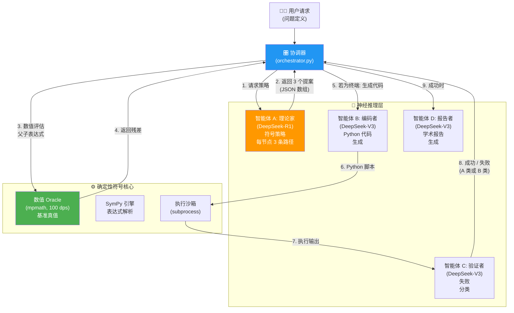
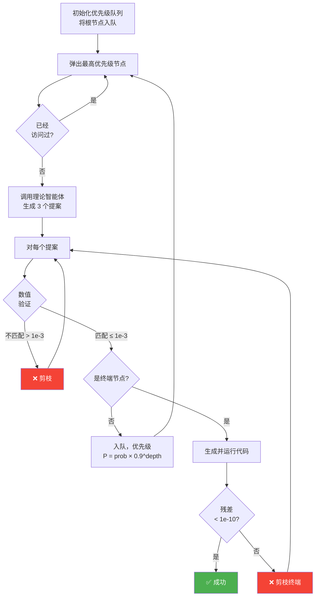
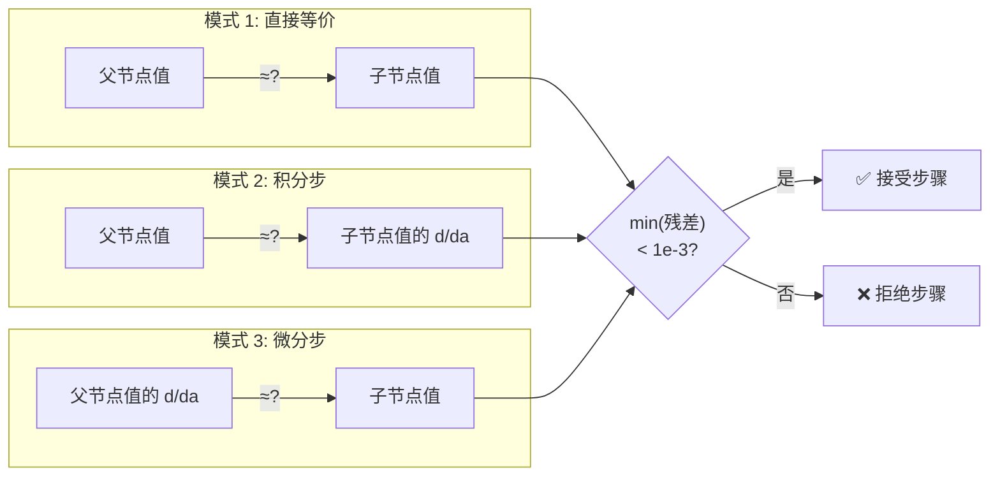
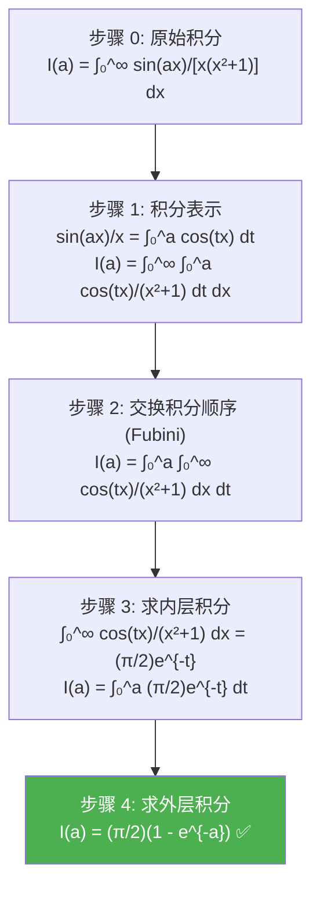

# 最终框架报告：神经符号物理求解器

> 本报告是多智能体系统的详细架构蓝图，涵盖智能体协作模型、推导树搜索引擎、数值验证管道以及使其运作的物理感知设计模式。

---

## 1. 系统架构概览

神经符号物理求解器作为一个**闭环反馈系统**运行，其中神经推理（LLM）提出假设，符号/数值计算对其进行验证。核心洞察是**探索与验证的分离**：LLM 永远不会被信任用于最终答案。



### 数据流摘要

| 步骤 | 来源 | 目标 | 有效载荷 |
|:---:|:---|:---|:---|
| 1 | 协调器 | 理论家 | 问题定义 + 当前推导状态 + 搜索上下文 |
| 2 | 理论家 | 协调器 | 包含 3 个 `{action_type, logic, sympy_code, is_terminal, success_probability}` 的 JSON 数组 |
| 3 | 协调器 | Oracle | 父表达式字符串 + 子表达式字符串 |
| 4 | Oracle | 协调器 | 数值 (mpf) 或失败时为 `None` |
| 5 | 协调器 | 编码者 | 问题定义 + 获胜提案的符号中间表示 |
| 6 | 编码者 | 沙箱 | 生成的 Python 脚本 (SymPy + mpmath) |
| 7 | 沙箱 | 验证者 | 脚本标准输出（最终数值结果） |
| 8 | 验证者 | 协调器 | `{status, residual, verdict, prune_branch}` |
| 9 | 协调器 | 报告者 | 完整的树日志 + 思考过程 + 最终解 |

---

## 2. 四大智能体：角色与内部机制

### 2.1. 智能体 A：理论家 (DeepSeek-R1)

**模型**：`deepseek-reasoner`（R1，具有扩展推理能力）

**核心约束——原子步骤规则**：理论家被明确指示每个提案只提出*恰好一个数学操作*。这防止 LLM 在单步中从问题"幻觉跳跃"到最终答案。

**输出格式**：恰好包含 3 个对象的 JSON 数组，每个对象包含：
```json
{
    "action_type": "Differentiation_under_Integral_Sign",
    "logic": "详细的数学推理依据...",
    "intermediate_expression": "新形式的 LaTeX 字符串",
    "sympy_code": "纯 SymPy 表达式字符串",
    "is_terminal": false,
    "success_probability": 0.9
}
```

**思考日志**：R1 的 `reasoning_content` 流中的所有内部推理令牌都被重定向到 `thinking_process.txt`。该文件作为系统外部化的"工作记忆"，对于调试和审计至关重要。

### 2.2. 智能体 B：编码者 (DeepSeek-V3)

**模型**：`deepseek-chat`（V3）

**角色**：将理论家的符号策略转化为可执行的 Python 代码，使用 `sympy` 进行符号操作，使用 `mpmath` 进行 50-dps 高精度数值评估。

**关键设计特性——点采样快速退出**：对于非终端步骤，编码者被给予一个 `oracle_point_val`（在特定点评估的被积函数值）。生成的脚本必须检查其自身的被积函数是否在 10% 以内匹配此值。如果不匹配，则引发 `EarlyExitException`，节省在注定失败的分支上进行完整数值积分的成本。

**关键规则**：对于**终端**（最终答案）节点，`oracle_point_val` **不会**传递给编码者。这防止了"某点的被积函数值"和"积分值"之间的混淆（参见经验教训志 §5.1）。

### 2.3. 智能体 C：验证者 (DeepSeek-V3)

**模型**：`deepseek-chat`（V3）

**执行管道**：
1. 在**沙箱子进程**中运行编码者的脚本 (`subprocess.run`)。
2. 从标准输出中提取最后一行数值。
3. 与 Oracle 的基准真值进行比较。
4. 如果残差 < $10^{-10}$：返回 `SUCCESS`。
5. 如果残差 >= $10^{-10}$：调用 V3 对失败进行分类：
   - **A 类（代数错误）**：公式结构正确但系数有误。建议：修正系数。
   - **B 类（策略错误）**：检测到奇点或发散。建议：完全改变数学基底。

**快速退出处理**：如果子进程引发 `EarlyExitException`，验证者立即返回 `FAIL` 判定，无需调用 AI 评论，节省 API 令牌。

### 2.4. 智能体 D：报告者 (DeepSeek-V3)

**模型**：`deepseek-chat`（V3）

**触发条件**：由协调器在 `SUCCESS`（编写胜利报告）或搜索耗尽时（编写事后分析）调用。

**输入**：完整的 `tree_log.json`、`thinking_process.txt`（如果太长则截断为最后 20,000 个字符）、问题定义和最终解（如有）。

**输出**：包含 LaTeX 方程、Mermaid 推理树图和逐步推导链分析的综合 Markdown 研究报告。

---

## 3. 推导树：深入剖析

推导树是管理求解器整个搜索空间的核心数据结构。它不是存储在内存中的字面树，而是由优先级队列和已访问集定义的隐式图。

### 3.1. 节点结构

搜索树中的每个节点是一个 Python 字典：

```python
node = {
    "expression": "Integral(cos(a*x)/(x**2+1), (x, 0, oo))",  # SymPy 表达式字符串
    "latex": "\\int_{0}^{\\infty} \\frac{\\cos(ax)}{x^2+1} dx", # 显示用的 LaTeX
    "depth": 1,                                                   # 从根节点的图深度
    "path": [step_0_dict, step_1_dict, ...]                       # 完整推导历史
}
```

### 3.2. 边结构（提案）

每条边是理论家的一个提案：

```python
edge = {
    "action_type": "Differentiation_under_Integral_Sign",
    "logic": "对参数 a 微分 I(a)...",
    "sympy_code": "Integral(cos(a*x)/(x**2+1), (x, 0, oo))",
    "is_terminal": False,
    "success_probability": 0.9
}
```

### 3.3. 最佳优先搜索引擎



**优先级启发式**：$P = \text{成功概率} \times 0.9^{\text{深度}}$

指数深度衰减有一个关键作用：确保搜索不会在单一深层分支中被困住，而忽略了存在更浅、更高概率的替代方案。示例：

| 节点 | 概率 | 深度 | 优先级 |
|:---|:---:|:---:|:---:|
| 部分分式分解 | 0.7 | 1 | 0.63 |
| 积分号下微分法 | 0.9 | 1 | 0.81 ✓ **（首先探索）** |
| 积分表示法 | 0.8 | 1 | 0.72 |
| 应用已知积分（来自微分路径） | 0.95 | 2 | 0.77 |
| 交换积分顺序（来自表示法路径） | 0.9 | 2 | 0.73 |

### 3.4. 验证模式

验证引擎支持 **3 种匹配模式**以处理不同类型的数学变换：



### 3.5. 状态持久化与恢复

在每个有效的（非终端）步骤被推入队列后，它也会被序列化到 `tree_log.json`：

```json
{
    "Checkpoint_1": {
        "from": "Integral(sin(a*x)/(x*(x**2+1)), (x, 0, oo))",
        "to": "Integral(cos(a*x)/(x**2+1), (x, 0, oo))",
        "action": "Differentiation_under_Integral_Sign",
        "logic": "对参数 a 微分 I(a)...",
        "prob": 0.9
    },
    "Checkpoint_2": { ... }
}
```

重启时，协调器读取此日志并从最后一个检查点重建搜索状态，实现从崩溃中的无缝恢复。

---

## 4. 数值 Oracle：设计细节

`NumericalOracle`（位于 `utils/numerical_oracle.py`）是系统的确定性支柱。它负责提供基准真值数值，所有 AI 生成的提案都会与之进行校验。

### 4.1. 核心方法

| 方法 | 用途 | 精度 |
|:---|:---|:---:|
| `evaluate_full_expression(problem, expr_str)` | 数值评估任何 SymPy 表达式字符串 | 100 dps |
| `evaluate_integrand(problem, point)` | 在特定点评估被积函数 | 50 dps |
| `evaluate_ground_truth(problem)` | 评估完整的定积分 | 100 dps |
| `evaluate_derivative(problem, expr_str, wrt)` | 数值微分表达式 | 中心差分, h=1e-7 |

### 4.2. 递归 `_eval_node` 引擎

`evaluate_full_expression` 的核心是一个处理 SymPy 抽象语法树的递归树遍历器：

```
_eval_node(node):
  ├── 是数字? → return mp.mpf(str(node))
  ├── 是 π, e, ∞, i? → return mp 常量
  ├── 是 Add? → return sum of _eval_node(args)
  ├── 是 Mul? → return product of _eval_node(args)
  ├── 是 Pow? → return base^exp
  ├── 是函数 (sin, cos, exp, ...)? → return mp.func(args)
  ├── 是 Integral? → return mp.quad(f_inner, [low, high])
  │     └── f_inner(v) = _eval_node(integrand.subs(var, v))
  │           └── 通过偏移 1e-20 处理可去奇点
  └── 后备 → return node.evalf(50)
```

### 4.3. 导数方法

导数通过**手动中心差分**计算，而非 SymPy 的符号微分或 mpmath 的复数步微分。这对含有嵌套积分的表达式更加鲁棒：

$$f'(a) \approx \frac{f(a + h) - f(a - h)}{2h}, \quad h = 10^{-7}$$

每次调用 $f(a \pm h)$ 都会创建问题的临时副本（参数已偏移），然后对该副本调用 `evaluate_full_expression`。

---

## 5. 成功推导：案例研究

系统成功求解了**参数化正弦衰减积分**：

$$I(a) = \int_{0}^{\infty} \frac{\sin(ax)}{x(x^2+1)} dx = \frac{\pi}{2}(1 - e^{-a}), \quad a > 0$$

### 5.1. 获胜推导路径



### 5.2. 探索过的替代路径（已剪枝）

| 路径 | 达到的深度 | 失败原因 |
|:---|:---:|:---|
| 部分分式分解 | 2 | 子积分 $\int_0^\infty x\sin(ax)/(x^2+1) dx$ 的数值不匹配（Diff: 0.415） |
| 围道积分 | 1 | 复值表达式的 Oracle 评估失败 |
| 二阶微分 ($I''(a)$) | 1 | 导致更复杂的积分表达式，被 BFS 降低优先级 |

### 5.3. 验证结果

| 参数 $a$ | 解析解 $\frac{\pi}{2}(1-e^{-a})$ | 数值 (mpmath) | 绝对残差 |
|:---:|:---:|:---:|:---:|
| 1 | 0.99293265... | 0.99293265... | $< 10^{-15}$ |
| 2 | 1.35804324... | 1.35804324... | $< 10^{-15}$ |
| 5 | 1.56028397... | 1.56028397... | $< 10^{-15}$ |

---

## 6. 设计哲学总结

### "用 AI 探索，用数学验证"

本系统的根本原则可以表述为：**LLM 永远不会被信任用于数值正确性。** 它纯粹被用作创造性的数学策略家——提出变换，然后由确定性引擎验证。

这种分离创建了一个继承了神经网络**创造力**（探索替换、识别积分恒等式）的系统，同时保持了符号计算的**严谨性**（每一步都经过 $10^{-3}$ 容差的数值验证，最终答案达到 $10^{-10}$）。

### 信任层级

```
最高信任：数值 Oracle (mpmath, 100 dps)
       ↓
中等信任：协调器逻辑 (确定性 Python)
       ↓
最低信任：LLM 智能体 (理论家、编码者、验证者、报告者)
```

每个 LLM 输出在影响系统状态之前都会通过一个确定性检查点。这是使系统可靠的关键架构决策。
