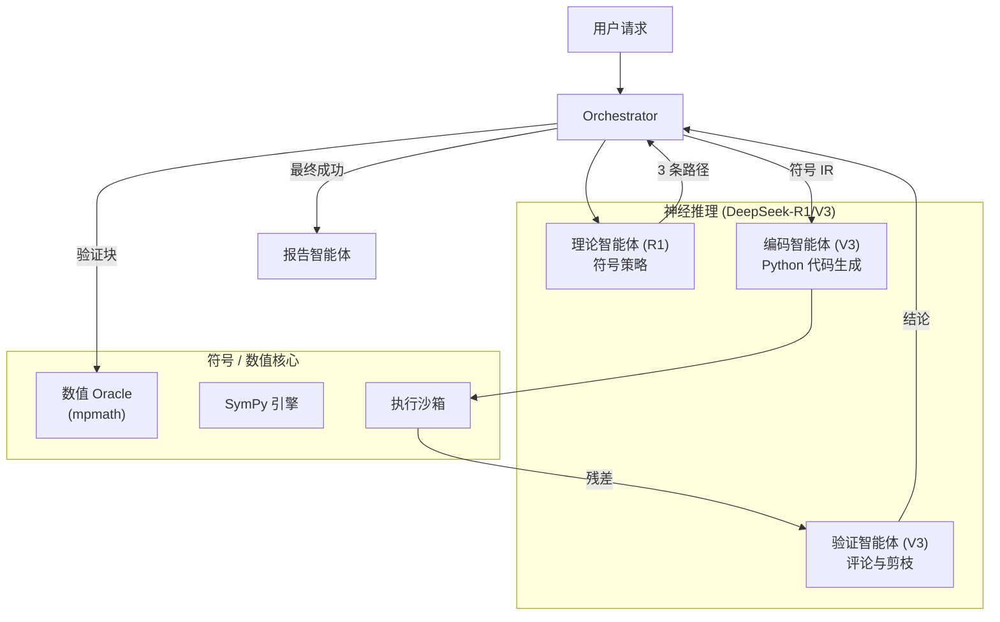

# 最终框架报告：神经符号物理求解器

## 1. 系统架构概览

该系统作为一个**神经符号反馈循环 (NeuroSymbolic Feedback Loop)** 运行，其中高层推理模型（神经网络）引导底层符号和数值引擎（符号逻辑）。

## 2. 深入了解：推导树 (Derivation Tree)

推导树是管理求解器搜索空间的核心数据结构。它能有效防止循环推理，并确保最有希望的路径得到优先处理。

### 节点与边结构
- **节点（数学状态）**：每个节点包含一个唯一的数学表达式（如原始积分、微分后的形式或代数简化）。它跟踪自身的“图深度” (`graph_depth`) 和父节点引用。
- **边（变换）**：每条边代表“理论智能体”提出的特定数学操作（如“换元法”、“分部积分”）。边存储了“操作类型” (`action_type`)、“逻辑” (`logic`) 辩护以及“成功概率” (`success_probability`)。

### 最佳优先搜索 (BFS) 引擎
系统不使用简单的线性推导，而是采用基于**优先级队列**的 BFS：
1. **优先级计算**：$P = 概率 \times 0.9^{深度}$。该公式偏好高置信度的步骤，但会惩罚过深且复杂的的分支，以防止“无限下降”。
2. **分支因子**：在每个节点处，“理论智能体”生成**3 个不同的路径**，确保策略的多样性（例如同时尝试分部积分与留数定理）。
3. **剪枝 (Pruning)**：“验证智能体”充当“审查者”。如果一条边导向的节点数值残差 $> 10^{-3}$，该整个分支将从队列中被剪掉。

### 状态持久化 (`tree_log.json`)
每次成功验证后，树结构都会序列化到磁盘。如果系统崩溃或遇到网络错误，协调器会从日志中重建优先级队列，从优先级最高的“叶子节点”恢复搜索。

## 3. “感知物理”的交互模式

| 特性 | 实现方式 | 益处 |
| :--- | :--- | :--- |
| **原子变换** | 理论智能体输出约束 | 防止 LLM 产生的“幻觉跳跃” |
| **点采样** | 编码智能体快速退出 | 通过快速失败节省 API token 和时间 |
| **微积分匹配** | Oracle 导数检查 | 正确验证积分 ($\int$) 和微分 ($\frac{d}{da}$) 操作 |
| **状态持久化** | tree_log.json | 抵御基础设施故障的韧性 |

## 4. 结论
该框架之所以成功，是因为它不信任 LLM 的最终计算结果。相反，它将 LLM 用作**数学探索者**，将符号/数值引擎用作**审查者**，从而创建了一个鲁棒的可验证发现系统。
