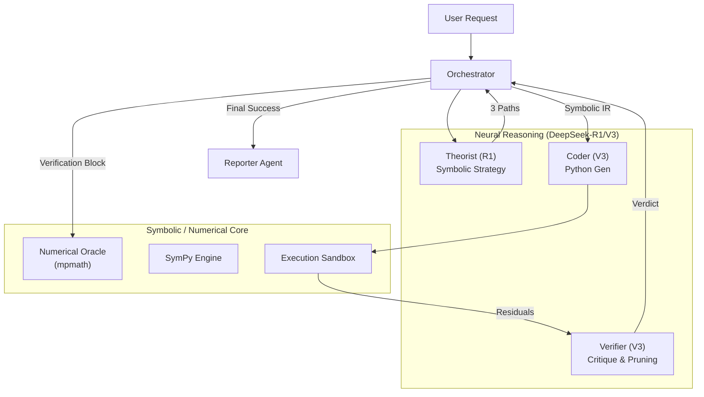

# Final Framework Report: NeuroSymbolic Physics Solver

## 1. System Architecture Overview

The system operates as a **NeuroSymbolic Feedback Loop**, where a high-level reasoning model (Neural) guides low-level symbolic and numerical engines (Symbolic).

## 2. Detailed Look: The Derivation Tree

The Derivation Tree is the core data structure that manages the solver's search space. It prevents circular reasoning and ensures that the most promising paths are prioritized.

### Node and Edge Structure
- **Nodes (Mathematical States)**: Each node contains a unique mathematical expression (e.g., the original integral, a differentiated form, or an algebraic simplification). It tracks its own `graph_depth` and parent reference.
- **Edges (Transformations)**: Each edge represents a specific mathematical operation proposed by the Theorist (e.g., "Substitution", "Integration by Parts"). Edges store the `action_type`, the `logic` justification, and the `success_probability`.

### The Best-First Search (BFS) Engine
Instead of a simple linear derivation, the system uses a **Priority Queue** based BFS:
1. **Priority Calculation**: $P = prob \times 0.9^{depth}$. This formula favors high-confidence steps but penalizes deep, complex branches to prevent "infinite descent".
2. **Branching Factor**: At each node, the Theorist generates exactly **3 distinct paths**, ensuring diversity in strategy (e.g., trying integration by parts vs. contour integration simultaneously).
3. **Pruning**: The Verifier acts as a "Censor". If an edge leads to a node where the numerical residual $> 10^{-3}$, that entire branch is pruned from the queue.

### State Persistence (`tree_log.json`)
The tree is serialized to disk after every successful verification. If the system crashes or encounters a network error, the Orchestrator reconstructs the priority queue from the log, resuming search from the highest-priority "leaf" node.

## 3. The "Physics-Aware" Interaction Pattern

| Feature | Implementation | Benefit |
| :--- | :--- | :--- |
| **Atomic Transformation** | Theorist Output Constraints | Prevents LLM "hallucination jumps" |
| **Point Sampling** | Coder Early Exit | Saves API tokens and time by failing fast |
| **Calculus Matching** | Oracle Derivative Check | Correctly verifies $\int$ and $\frac{d}{da}$ operations |
| **State Persistence** | tree_log.json | Resilience against infrastructure failure |

## 4. Conclusion
The framework succeeds because it does not trust the LLM with the final calculation. Instead, it uses the LLM as a **Mathematical Explorer** and the Symbolic/Numerical engines as **Censors**, creating a robust system for verifiable discovery.
