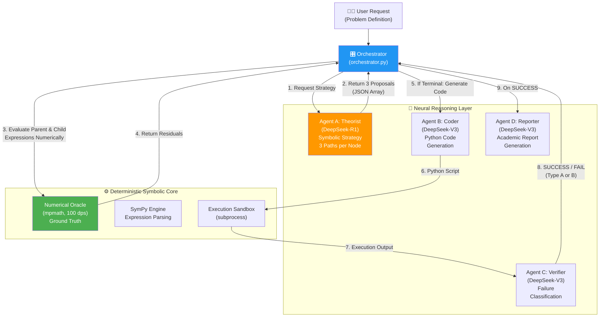
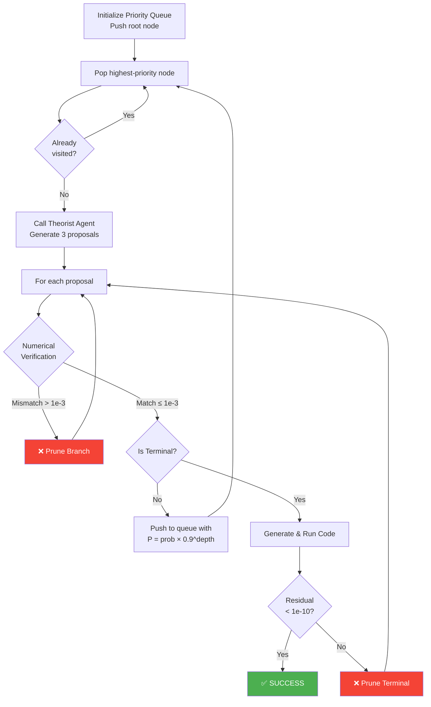
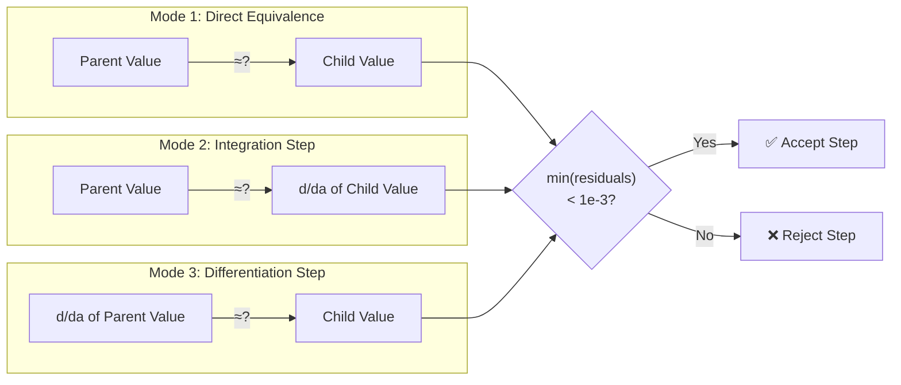
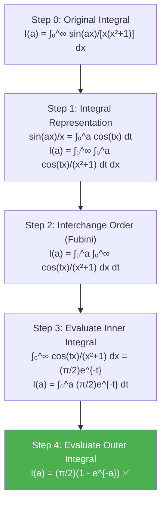

# Final Framework Report: NeuroSymbolic Physics Solver

> A detailed architectural blueprint of the multi-agent system, covering the agent collaboration model, the derivation tree search engine, the numerical verification pipeline, and the physics-aware design patterns that make it work.

---

## 1. System Architecture Overview

The NeuroSymbolic Physics Solver operates as a **closed-loop feedback system** where neural reasoning (LLMs) proposes hypotheses and symbolic/numerical computation verifies them. The key insight is the **separation of exploration and verification**: the LLM is never trusted with the final answer.



### Data Flow Summary

| Step | From | To | Payload |
|:---:|:---|:---|:---|
| 1 | Orchestrator | Theorist | Problem definition + current derivation state + search context |
| 2 | Theorist | Orchestrator | JSON array of 3 `{action_type, logic, sympy_code, is_terminal, success_probability}` |
| 3 | Orchestrator | Oracle | Parent expression string + Child expression string |
| 4 | Oracle | Orchestrator | Numerical values (mpf) or `None` on failure |
| 5 | Orchestrator | Coder | Problem definition + winning proposal's symbolic IR |
| 6 | Coder | Sandbox | Generated Python script (SymPy + mpmath) |
| 7 | Sandbox | Verifier | Script stdout (final numerical result) |
| 8 | Verifier | Orchestrator | `{status, residual, verdict, prune_branch}` |
| 9 | Orchestrator | Reporter | Full tree log + thinking process + final solution |

---

## 2. The Four Agents: Roles and Internals

### 2.1. Agent A: The Theorist (DeepSeek-R1)

**Model**: `deepseek-reasoner` (R1 with extended reasoning capability)

**Core Constraint — The Atomic Step Rule**: The Theorist is explicitly instructed to propose *exactly one mathematical operation* per proposal. This prevents the LLM from "hallucination-jumping" from the problem to a final answer in a single step.

**Output Format**: A JSON array of exactly 3 objects, each containing:
```json
{
    "action_type": "Differentiation_under_Integral_Sign",
    "logic": "Detailed mathematical justification...",
    "intermediate_expression": "LaTeX string of the new form",
    "sympy_code": "Pure SymPy expression string",
    "is_terminal": false,
    "success_probability": 0.9
}
```

**Thinking Log**: All internal reasoning tokens from R1's `reasoning_content` stream are redirected to `thinking_process.txt`. This file serves as the system's externalized "working memory" and is essential for debugging and auditing.

### 2.2. Agent B: The Coder (DeepSeek-V3)

**Model**: `deepseek-chat` (V3)

**Role**: Translates the Theorist's symbolic strategy into executable Python code using `sympy` for symbolic manipulation and `mpmath` for 50-dps high-precision numerical evaluation.

**Key Design Feature — Early Exit Point Sampling**: For non-terminal steps, the Coder is given an `oracle_point_val` (the integrand evaluated at a specific point). The generated script must check if its own integrand matches this value within 10%. If not, it raises `EarlyExitException`, saving the cost of a full numerical integration on a doomed branch.

**Critical Rule**: For **terminal** (final answer) nodes, `oracle_point_val` is NOT passed to the Coder. This prevents the confusion between "integrand value at a point" and "integral value" that caused the Early Exit bug (see Experience Log §5.1).

### 2.3. Agent C: The Verifier (DeepSeek-V3)

**Model**: `deepseek-chat` (V3)

**Execution Pipeline**:
1. Run the Coder's script in a **sandboxed subprocess** (`subprocess.run`).
2. Extract the last numerical line from stdout.
3. Compare with the Oracle's ground-truth value.
4. If residual < $10^{-10}$: return `SUCCESS`.
5. If residual >= $10^{-10}$: invoke V3 to classify the failure:
   - **Type A (Algebraic Error)**: Formula structure is correct but coefficients are wrong. Recommendation: fix coefficients.
   - **Type B (Strategy Error)**: Singularity or divergence detected. Recommendation: change mathematical basis entirely.

**EarlyExit Handling**: If the subprocess raises `EarlyExitException`, the Verifier immediately returns a `FAIL` verdict without invoking the AI critique, saving API tokens.

### 2.4. Agent D: The Reporter (DeepSeek-V3)

**Model**: `deepseek-chat` (V3)

**Trigger**: Called by the Orchestrator either on `SUCCESS` (to compile a victory report) or on search exhaustion (to compile a post-mortem).

**Input**: The full `tree_log.json`, the `thinking_process.txt` (truncated to last 20,000 characters if too long), the problem definition, and the final solution (if any).

**Output**: A comprehensive Markdown research report with LaTeX equations, a Mermaid reasoning tree diagram, and a step-by-step analysis of the derivation chain.

---

## 3. The Derivation Tree: Deep Dive

The Derivation Tree is the central data structure that manages the solver's entire search space. It is not a literal tree stored in memory, but rather an implicit graph defined by the priority queue and the visited set.

### 3.1. Node Structure

Each node in the search tree is a Python dictionary:

```python
node = {
    "expression": "Integral(cos(a*x)/(x**2+1), (x, 0, oo))",  # SymPy expression string
    "latex": "\\int_{0}^{\\infty} \\frac{\\cos(ax)}{x^2+1} dx", # LaTeX for display
    "depth": 1,                                                   # Graph depth from root
    "path": [step_0_dict, step_1_dict, ...]                       # Full derivation history
}
```

### 3.2. Edge Structure (Proposals)

Each edge is a proposal from the Theorist:

```python
edge = {
    "action_type": "Differentiation_under_Integral_Sign",
    "logic": "Differentiate I(a) w.r.t. parameter a...",
    "sympy_code": "Integral(cos(a*x)/(x**2+1), (x, 0, oo))",
    "is_terminal": False,
    "success_probability": 0.9
}
```

### 3.3. The Best-First Search Engine



**Priority Heuristic**: $P = \text{success\_probability} \times 0.9^{\text{depth}}$

The exponential depth decay serves a critical purpose: it ensures the search doesn't get trapped in a single deep branch when shallower, higher-probability alternatives exist. Example:

| Node | Probability | Depth | Priority |
|:---|:---:|:---:|:---:|
| Partial Fractions | 0.7 | 1 | 0.63 |
| Differentiation under ∫ | 0.9 | 1 | 0.81 ✓ **(explored first)** |
| Integral Representation | 0.8 | 1 | 0.72 |
| Apply Known Integral (from Diff path) | 0.95 | 2 | 0.77 |
| Interchange Order (from IntRep path) | 0.9 | 2 | 0.73 |

### 3.4. Verification Modes

The verification engine supports **3 matching modes** to handle different types of mathematical transformations:



### 3.5. State Persistence and Resumption

After every valid (non-terminal) step is pushed to the queue, it is also serialized to `tree_log.json`:

```json
{
    "Checkpoint_1": {
        "from": "Integral(sin(a*x)/(x*(x**2+1)), (x, 0, oo))",
        "to": "Integral(cos(a*x)/(x**2+1), (x, 0, oo))",
        "action": "Differentiation_under_Integral_Sign",
        "logic": "Differentiate I(a) with respect to parameter a...",
        "prob": 0.9
    },
    "Checkpoint_2": { ... }
}
```

On restart, the Orchestrator reads this log and reconstructs the search state from the last checkpoint, allowing seamless recovery from crashes.

---

## 4. The Numerical Oracle: Design Details

The `NumericalOracle` (in `utils/numerical_oracle.py`) is the deterministic backbone of the system. It is responsible for providing ground-truth numerical values that all AI-generated proposals are checked against.

### 4.1. Core Methods

| Method | Purpose | Precision |
|:---|:---|:---:|
| `evaluate_full_expression(problem, expr_str)` | Evaluates any SymPy expression string numerically | 100 dps |
| `evaluate_integrand(problem, point)` | Evaluates the integrand at a specific point | 50 dps |
| `evaluate_ground_truth(problem)` | Evaluates the full definite integral | 100 dps |
| `evaluate_derivative(problem, expr_str, wrt)` | Numerically differentiates an expression | Central diff, h=1e-7 |

### 4.2. The Recursive `_eval_node` Engine

The heart of `evaluate_full_expression` is a recursive tree-walker that handles SymPy's AST:

```
_eval_node(node):
  ├── Is it a Number? → return mp.mpf(str(node))
  ├── Is it π, e, ∞, i? → return mp constant
  ├── Is it Add? → return sum of _eval_node(args)
  ├── Is it Mul? → return product of _eval_node(args)
  ├── Is it Pow? → return base^exp
  ├── Is it a Function (sin, cos, exp, ...)? → return mp.func(args)
  ├── Is it an Integral? → return mp.quad(f_inner, [low, high])
  │     └── f_inner(v) = _eval_node(integrand.subs(var, v))
  │           └── Handles removable singularities with offset 1e-20
  └── Fallback → return node.evalf(50)
```

### 4.3. The Derivative Method

The derivative is computed via **manual central difference** rather than SymPy's symbolic differentiation or mpmath's complex-step differentiation. This is more robust for expressions involving nested integrals:

$$f'(a) \approx \frac{f(a + h) - f(a - h)}{2h}, \quad h = 10^{-7}$$

Each call to $f(a \pm h)$ creates a temporary copy of the problem with the parameter shifted, then calls `evaluate_full_expression` on that copy.

---

## 5. The Successful Derivation: A Case Study

The system successfully solved the **Parametric Sinusoidal Decay Integral**:

$$I(a) = \int_{0}^{\infty} \frac{\sin(ax)}{x(x^2+1)} dx = \frac{\pi}{2}(1 - e^{-a}), \quad a > 0$$

### 5.1. The Winning Derivation Path



### 5.2. Alternative Paths Explored (and Pruned)

| Path | Depth Reached | Failure Reason |
|:---|:---:|:---|
| Partial Fraction Decomposition | 2 | Numerical mismatch (Diff: 0.415) for the sub-integral $\int_0^\infty x\sin(ax)/(x^2+1) dx$ |
| Contour Integration | 1 | Oracle evaluation failed for complex-valued expressions |
| Second Differentiation ($I''(a)$) | 1 | Led to a more complex integral expression, deprioritized by BFS |

### 5.3. Verification Results

| Parameter $a$ | Analytical $\frac{\pi}{2}(1-e^{-a})$ | Numerical (mpmath) | Absolute Residual |
|:---:|:---:|:---:|:---:|
| 1 | 0.99293265... | 0.99293265... | $< 10^{-15}$ |
| 2 | 1.35804324... | 1.35804324... | $< 10^{-15}$ |
| 5 | 1.56028397... | 1.56028397... | $< 10^{-15}$ |

---

## 6. Design Philosophy Summary

### "Explore with AI, Verify with Math"

The fundamental principle of this system can be stated as: **The LLM is never trusted with numerical correctness.** It is used purely as a creative mathematical strategist — proposing transformations that a deterministic engine then validates.

This separation creates a system that inherits the **creativity** of neural networks (exploring substitutions, recognizing integral identities) while maintaining the **rigor** of symbolic computation (every step is numerically verified to $10^{-3}$ tolerance, and the final answer to $10^{-10}$).

### The Trust Hierarchy

```
Highest Trust: Numerical Oracle (mpmath, 100 dps)
       ↓
Medium Trust:  Orchestrator Logic (deterministic Python)
       ↓
Lowest Trust:  LLM Agents (Theorist, Coder, Verifier, Reporter)
```

Every LLM output passes through a deterministic checkpoint before influencing the system state. This is the key architectural decision that makes the system reliable.
