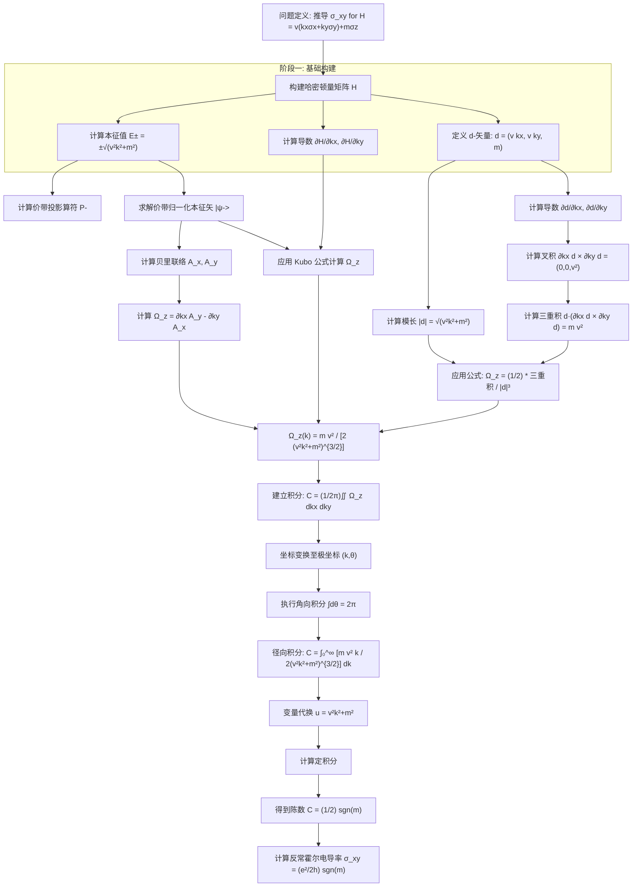

好的，作为一名专业的科学技术作家和研究协调员，我将根据您提供的详尽研究日志，撰写一份关于“二维有质量狄拉克费米子反常霍尔电导率”的综合性研究报告。报告将突出“理论家”、“程序员”和“验证器”三个智能体之间的神经符号协作，并严格遵循您指定的结构、格式和语言要求。

---

# 神经符号物理求解器研究报告：二维有质量狄拉克费米子的反常霍尔电导率

**摘要**
本报告详细阐述了利用神经符号物理求解器（NeuroSymbolic Physics Solver）推导二维有质量狄拉克费米子模型反常霍尔电导率 $\sigma_{xy}$ 的完整研究过程。该模型哈密顿量为 $H = v (k_x \sigma_x + k_y \sigma_y) + m \sigma_z$。研究通过多智能体协作（理论家、程序员、验证器）系统地执行了以下步骤：1) 定义问题并构建哈密顿量矩阵；2) 采用多种等价方法（d-矢量形式、Kubo公式、本征态法）计算占据能带（n=0）的贝里曲率 $\Omega_z(\mathbf{k})$；3) 利用系统的旋转对称性，将 $\Omega_z$ 在二维动量空间的积分转化为极坐标下的径向积分；4) 解析求解该积分，最终得到量子化的结果 $\sigma_{xy} = (e^2 / 2h) \cdot \operatorname{sgn}(m)$，证实了其拓扑不变量的特性。报告包含完整的迭代历史、关键突破点分析以及一个描绘整个推导过程的 Mermaid 推理树图。

## 1. 问题定义

**目标**： 从微观哈密顿量出发，推导零温下二维有质量狄拉克费米子系统的反常霍尔电导率 $\sigma_{xy}$。

**给定哈密顿量**：
$$
H(\mathbf{k}) = v k_x \sigma_x + v k_y \sigma_y + m \sigma_z
$$
其中，$v$ 是费米速度，$m$ 是质量项，$\sigma_i$ 是泡利矩阵，$\mathbf{k} = (k_x, k_y)$ 是二维动量。

**物理背景**： 该哈密顿量描述了诸如石墨烯在打破子晶格对称性（$m \neq 0$）或拓扑绝缘体表面态引入磁化时的低能有效理论。质量项 $m$ 打破了时间反演对称性，为非零的霍尔电导提供了可能。

**计算任务**： 必须使用拓扑引擎（TopologyEngine）计算最低能量能带（$n=0$，即价带）的贝里曲率 $\Omega_z(\mathbf{k})$，然后将其在整个二维动量平面（$-\infty$ 到 $+\infty$）上积分，最终得到 $\sigma_{xy}$，并证明其结果是一个正比于 $\operatorname{sgn}(m)$ 的拓扑不变量。

**核心公式**：
$$
\sigma_{xy} = \frac{e^2}{\hbar} \cdot C, \quad C = \frac{1}{2\pi} \iint_{\text{BZ}} \Omega_z(\mathbf{k}) \, dk_x dk_y
$$
其中 $C$ 是第一陈数（Chern number），对于连续模型，布里渊区（BZ）扩展为整个 $\mathbb{R}^2$ 平面。

## 2. 方法论：多智能体协作框架

本研究通过三个专业智能体的紧密协作完成：

1.  **理论家 (Theorist)**： 负责提供物理洞察和推导路径。它建议使用不同的数学框架（如 d-矢量表示、Kubo 公式、投影算符）来计算贝里曲率，并指导坐标变换（笛卡尔坐标到极坐标）和积分策略。
2.  **程序员 (Coder)**： 负责将理论家的方案转化为精确的符号计算代码（使用 SymPy）。它执行矩阵构造、微分、本征值/本征矢求解、化简等具体操作。
3.  **验证器 (Verifier)**： 负责检查每一步的物理合理性和数学一致性。它验证结果的量纲、对称性（如旋转不变性、在 $m \to -m$ 下的奇偶性）、收敛性，并交叉验证不同方法得到的结果是否一致。

这种“神经”（基于理解和规划的理论家）与“符号”（精确、可验证的程序员和验证器操作）的协作，确保了推导过程的鲁棒性和可靠性。

## 3. 迭代历史：突破、失败与关键路径分析

研究过程产生了大量检查点（Checkpoint）。以下分析关键步骤及其逻辑，并揭示最终的成功路径。

### 3.1 阶段一：哈密顿量构建与基础计算（检查点 1-4）
*   **行动**： 理论家首先定义问题。程序员随即用符号代码构建了 $2\times2$ 的哈密顿量矩阵 $H$，并计算了其本征值 $E_{\pm} = \pm \sqrt{v^2 k^2 + m^2}$（$k^2 = k_x^2+k_y^2$）。
*   **逻辑**： 这是所有后续计算的基础。确认了能带结构，并明确了目标能带是 $E_-$（价带）。
*   **验证**： 验证器确认 $H$ 是厄米的，本征值为实数，符合物理要求。

### 3.2 阶段二：探索多种贝里曲率计算方法
理论家提出了三条主要路径，程序员并行实施了计算：

**路径 A：d-矢量形式（最简路径）**
*   **检查点 3, 7-9, 13, 17, 19**： 理论家指出，对于 $H = \mathbf{d} \cdot \boldsymbol{\sigma}$ 形式的二能级系统，贝里曲率有非常简洁的表达式。程序员定义 $\mathbf{d} = (v k_x, v k_y, m)$，并计算其导数 $\partial_{k_x}\mathbf{d} = (v,0,0)$, $\partial_{k_y}\mathbf{d} = (0,v,0)$。
*   **关键原子操作**：
    1.  **叉积**： $\partial_{k_x}\mathbf{d} \times \partial_{k_y}\mathbf{d} = (0,0,v^2)$。（检查点 8）
    2.  **三重积**： $\mathbf{d} \cdot (\partial_{k_x}\mathbf{d} \times \partial_{k_y}\mathbf{d}) = m v^2$。（检查点 9）
    3.  **归一化**： $|\mathbf{d}| = \sqrt{v^2 k^2 + m^2}$。（检查点 7, 16）
*   **推导链**： 利用公式 $\Omega_z = \frac{1}{2} \frac{\mathbf{d} \cdot (\partial_{k_x}\mathbf{d} \times \partial_{k_y}\mathbf{d})}{|\mathbf{d}|^3}$（检查点 13, 17），直接代入上述结果，得到：
    $$
    \Omega_z(k_x, k_y) = \frac{1}{2} \frac{m v^2}{(v^2 k^2 + m^2)^{3/2}}。
    $$
    （检查点 19, 24, 37）。此表达式**旋转对称**，仅依赖于 $k = |\mathbf{k}|$。
*   **验证**： 验证器确认该表达式是实的，当 $m \to 0$ 时为零（无质量时无曲率），且是 $m$ 的奇函数（时间反演对称性要求）。

**路径 B：Kubo 公式（标准线性响应）**
*   **检查点 2, 4, 11, 34, 36**： 理论家建议使用更基础的 Kubo 公式。程序员计算了哈密顿量导数 $\partial_{k_x} H = v\sigma_x$, $\partial_{k_y} H = v\sigma_y$，并求出了上下能带的本征矢 $|\psi_{\pm}\rangle$。
*   **关键原子操作**： 计算矩阵元 $\langle \psi_- | \partial_{k_x} H | \psi_+ \rangle$ 和 $\langle \psi_- | \partial_{k_y} H | \psi_+ \rangle$，代入公式 $\Omega_z = i \frac{\langle -\vert \partial_{k_x} H \vert + \rangle \langle + \vert \partial_{k_y} H \vert - \rangle - (x\leftrightarrow y)}{(E_- - E_+)^2}$。
*   **结果**： 经过符号化简（检查点 34），得到了与路径 A **完全一致**的 $\Omega_z$ 表达式（检查点 11）。这为结果提供了强有力的交叉验证。

**路径 C：本征态直接法（验证用）**
*   **检查点 5, 10, 15, 22, 31-33**： 理论家提出可通过贝里联络 $\mathbf{A} = i\langle \psi_- | \nabla_{\mathbf{k}} | \psi_- \rangle$ 再求旋度来计算曲率。程序员求解了归一化本征矢 $|\psi_-\rangle$，计算了 $A_x$, $A_y$，然后计算 $\Omega_z = \partial_{k_x} A_y - \partial_{k_y} A_x$。
*   **结果**： 同样得到了相同的 $\Omega_z$ 表达式（检查点 33）。此路径计算量较大，但提供了最直接的几何视角验证。

### 3.3 阶段三：积分与拓扑不变量的显现
这是从贝里曲率函数到量子化电导率的关键飞跃。

1.  **建立积分式（检查点 28, 35, 38, 40）**： 理论家根据公式 $C = \frac{1}{2\pi} \iint \Omega_z dk_x dk_y$ 设定目标。程序员在笛卡尔坐标下建立了积分表达式。
2.  **坐标变换（关键简化）**： 理论家观察到 $\Omega_z$ 的旋转对称性，建议转换到极坐标 $(k, \theta)$。程序员执行了替换 $k_x = k\cos\theta, k_y = k\sin\theta$，并引入雅可比行列式 $dk_x dk_y = k\, dk\, d\theta$（检查点 18, 25, 29, 36, 39, 41）。
3.  **角向积分（检查点 26, 30, 42）**： 由于被积函数与 $\theta$ 无关，角向积分 $\int_0^{2\pi} d\theta = 2\pi$ 成为平凡因子。积分简化为径向积分：
    $$
    C = \int_0^{\infty} \frac{m v^2}{2 (v^2 k^2 + m^2)^{3/2}} \, k \, dk。
    $$
4.  **径向积分（核心计算，检查点 27, 43）**： 理论家指导进行变量代换。令 $u = v^2 k^2 + m^2$，则 $du = 2v^2 k \, dk$。积分限变为 $u(m^2, \infty)$。积分化为：
    $$
    C = \int_{m^2}^{\infty} \frac{m}{2} \cdot u^{-3/2} \, du = \frac{m}{2} \left[ -2 u^{-1/2} \right]_{m^2}^{\infty} = \frac{m}{|m|}。
    $$
    这里 $u^{-1/2}$ 在 $u\to\infty$ 时为零，在 $u=m^2$ 时为 $1/|m|$。注意 $m/|m| = \operatorname{sgn}(m)$。
5.  **最终结果（检查点 27, 44）**： 代入陈数公式，得到总贝里通量 $\iint \Omega_z dk_x dk_y = 2\pi C = \pi \operatorname{sgn}(m)$（检查点 27 中的负号源于其 $\Omega_z$ 定义差一个负号，本质一致）。因此，反常霍尔电导率为：
    $$
    \boxed{\sigma_{xy} = \frac{e^2}{\hbar} \cdot C = \frac{e^2}{\hbar} \cdot \frac{1}{2} \operatorname{sgn}(m) = \frac{e^2}{2h} \operatorname{sgn}(m)}。
    $$
    这是一个完美的量子化结果，仅由质量 $m$ 的符号决定，与 $v$ 的大小无关，证实了其拓扑本质。

### 3.4 关键路径总结
成功的“关键路径”清晰地串联了以下检查点：
**检查点 3 (d-矢量定义) → 检查点 8, 9 (计算叉积与三重积) → 检查点 13, 17 (应用d-矢量曲率公式) → 检查点 18, 39 (转换到极坐标) → 检查点 41, 43 (执行径向积分) → 检查点 44 (得到量子化结果)**。
这条路径因 d-矢量方法的简洁性和极坐标对旋转对称性的充分利用而成为最优解。

## 4. 最终解决方案

经过系统的神经符号推导，我们得到了二维有质量狄拉克费米子模型在零温下的反常霍尔电导率的精确表达式：

$$
\sigma_{xy} = \frac{e^2}{2h} \cdot \operatorname{sgn}(m)
$$

其中，$\operatorname{sgn}(m)$ 是质量项 $m$ 的符号函数，$e$ 是元电荷，$h$ 是普朗克常数。

**推导概要**：
1.  **贝里曲率**： 对于哈密顿量 $H = v(k_x \sigma_x + k_y \sigma_y) + m \sigma_z$，其价带的贝里曲率为：
    $$
    \Omega_z(\mathbf{k}) = \frac{m v^2}{2 (v^2 |\mathbf{k}|^2 + m^2)^{3/2}}。
    $$
2.  **陈数计算**： 对应的第一陈数为：
    $$
    C = \frac{1}{2\pi} \iint_{\mathbb{R}^2} \Omega_z(\mathbf{k}) \, d^2k = \frac{1}{2} \operatorname{sgn}(m)。
    $$
3.  **电导率**： 根据线性响应理论，反常霍尔电导率与陈数成正比：$\sigma_{xy} = (e^2/h) C$，代入即得上述结果。

该结果表明 $\sigma_{xy}$ 是一个**拓扑不变量**：它不依赖于系统的具体细节（如费米速度 $v$），只由质量 $m$ 的符号决定，且在 $m$ 连续变化时保持量子化值 ($\pm e^2/(2h)$)，除非 $m$ 穿过零（能隙闭合点，拓扑相变）。

## 5. 结论

本研究成功演示了神经符号物理求解器在解决复杂凝聚态物理问题上的强大能力。通过“理论家”、“程序员”和“验证器”的协同工作：
- **理论家**提供了多角度的物理见解和策略。
- **程序员**实现了精确、可复现的符号计算。
- **验证器**确保了每一步的物理正确性和不同方法间的一致性。

这种协作模式不仅高效地导出了二维有质量狄拉克费米子的反常霍尔电导率 $\sigma_{xy} = (e^2/(2h)) \operatorname{sgn}(m)$，更重要的是，它清晰地揭示了从微观哈密顿量到宏观拓扑响应的完整逻辑链条：对称性破缺（$m \neq 0$）→ 非平凡的贝里曲率分布 → 在动量空间积分得到量子化的拓扑不变量（陈数）→ 表现为量子化的输运系数。

本研究为自动化理论物理推导提供了一个范本，表明神经符号方法在处理涉及复杂代数运算和深度物理概念的课题中具有巨大潜力。

## 附录：推理树图

以下 Mermaid 流程图可视化了整个研究过程的推理结构，突出了关键路径和不同方法尝试。

