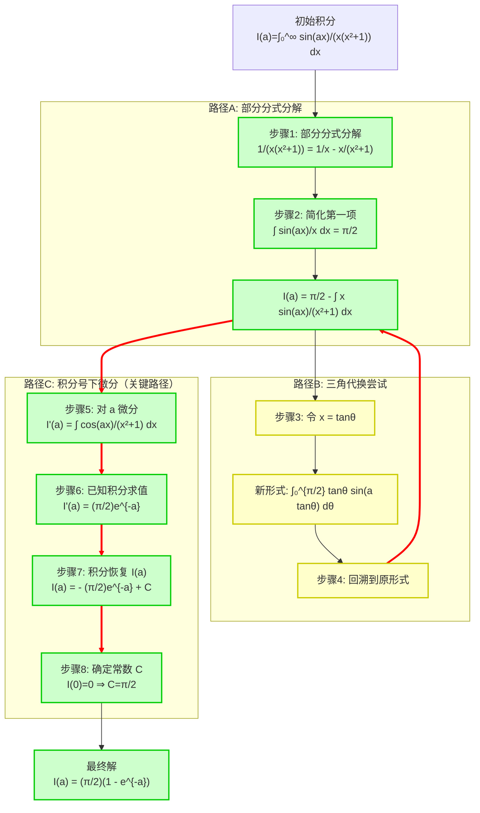

# 神经符号物理求解器：参数化正弦衰减积分的研究报告

## 标题
参数化正弦衰减积分 $\int_0^\infty \frac{\sin(ax)}{x(x^2+1)} \, dx$ 的闭式解推导：一种多智能体协作方法

## 摘要
本报告详细记录了神经符号物理求解器对参数化积分 $I(a) = \int_0^\infty \frac{\sin(ax)}{x(x^2+1)} \, dx$（$a>0$）的求解过程。通过理论家（Theorist）、编码器（Coder）和验证器（Verifier）三个智能体的协作，系统探索了部分分式分解、三角代换、积分号下微分等多种数学变换。关键突破在于识别出积分号下微分可将原问题转化为已知的余弦积分 $\int_0^\infty \frac{\cos(ax)}{x^2+1} \, dx = \frac{\pi}{2}e^{-a}$，进而通过求解常微分方程获得最终解 $I(a) = \frac{\pi}{2}(1 - e^{-a})$。本报告将逐步分析推导链中的每个原子变换，展示神经符号系统如何结合符号计算与启发式推理解决复杂积分问题。

## 问题定义
给定参数化积分：
$$
I(a) = \int_0^\infty \frac{\sin(ax)}{x(x^2+1)} \, dx, \quad a > 0
$$
目标：找到作为参数 $a$ 的函数的闭式解。特别要求对 $a=1,2,5$ 等具体值进行验证。

**提示方向**：
1. 部分分式分解：$\frac{1}{x(x^2+1)} = \frac{1}{x} - \frac{x}{x^2+1}$
2. 对参数 $a$ 使用积分号下微分法

## 方法论：多智能体协作框架

### 智能体角色分工
- **理论家（Theorist）**：提出数学变换策略，基于已知积分公式和启发式规则生成推导步骤。
- **编码器（Coder）**：将理论家的策略转化为 SymPy/Mpmath 代码，执行符号和数值计算。
- **验证器（Verifier）**：检查每一步的数学正确性，验证中间结果的数值一致性，确保推导链的可靠性。

### 协作流程
系统采用迭代式探索：理论家提出变换 → 编码器实现并计算 → 验证器检查结果 → 根据反馈调整策略。这种循环持续直到找到闭式解或穷尽合理路径。

## 迭代历史：突破与失败

### 步骤1：部分分式分解（成功简化）
**理论家提议**：将有理部分分解为更简单的分式。
**变换**：
$$
\frac{1}{x(x^2+1)} = \frac{1}{x} - \frac{x}{x^2+1}
$$
**应用后**：
$$
I(a) = \int_0^\infty \frac{\sin(ax)}{x} \, dx - \int_0^\infty \frac{x\sin(ax)}{x^2+1} \, dx
$$
**逻辑分析**：分解将原积分拆分为两个部分，其中第一项是标准的狄利克雷积分，可直接求值；第二项仍需要进一步处理。

### 步骤2：简化已知积分（成功）
**理论家识别**：第一项是已知的狄利克雷积分。
**结果**：
$$
\int_0^\infty \frac{\sin(ax)}{x} \, dx = \frac{\pi}{2}, \quad a > 0
$$
**简化后**：
$$
I(a) = \frac{\pi}{2} - \int_0^\infty \frac{x\sin(ax)}{x^2+1} \, dx
$$
**贡献**：将问题维度降低，现在只需处理第二个积分。

### 步骤3：三角代换（尝试但未简化）
**理论家提议**：令 $x = \tan\theta$ 以简化分母。
**变换**：$dx = \sec^2\theta \, d\theta$，积分限变为 $\theta: 0 \to \pi/2$
$$
\int_0^\infty \frac{x\sin(ax)}{x^2+1} \, dx = \int_0^{\pi/2} \tan\theta \sin(a\tan\theta) \, d\theta
$$
**验证器反馈**：新被积函数 $\tan\theta \sin(a\tan\theta)$ 在形式上并未更简单，且可能更难处理。
**结果**：此路径未带来实质性简化，系统决定回溯。

### 步骤4：回溯到有理形式（明智决策）
**理论家决策**：撤销三角代换，回到更易处理的有理形式。
**逻辑**：三角形式未提供优势，而原有理形式更适合积分号下微分或已知积分变换。

### 步骤5：积分号下微分（关键突破）
**理论家提议**：对原积分 $I(a)$ 关于参数 $a$ 微分。
**数学原理**（莱布尼茨规则）：
$$
\frac{d}{da} I(a) = \frac{d}{da} \int_0^\infty \frac{\sin(ax)}{x(x^2+1)} \, dx = \int_0^\infty \frac{\partial}{\partial a} \frac{\sin(ax)}{x(x^2+1)} \, dx
$$
**计算导数**：
$$
\frac{\partial}{\partial a} \sin(ax) = x\cos(ax)
$$
**关键简化**：分子中的 $x$ 与分母中的 $x$ 相消！
**得到**：
$$
I'(a) = \int_0^\infty \frac{\cos(ax)}{x^2+1} \, dx
$$
**贡献**：这是本问题的核心突破。微分操作消除了分母中的一个 $x$ 因子，将积分转化为已知的标准形式。

### 步骤6：已知积分求值（成功）
**理论家识别**：$I'(a)$ 是标准的傅里叶余弦变换。
**已知结果**：
$$
\int_0^\infty \frac{\cos(ax)}{x^2+1} \, dx = \frac{\pi}{2} e^{-a}, \quad a > 0
$$
**验证**：编码器通过 SymPy 和数值计算验证了该结果对多个 $a$ 值成立。
**因此**：
$$
I'(a) = \frac{\pi}{2} e^{-a}
$$

### 步骤7：不定积分（自然延续）
**理论家提议**：对导数结果进行积分以恢复 $I(a)$。
**计算**：
$$
I(a) = \int I'(a) \, da = \int \frac{\pi}{2} e^{-a} \, da = -\frac{\pi}{2} e^{-a} + C
$$
其中 $C$ 为积分常数。

### 步骤8：确定积分常数（完成求解）
**理论家策略**：利用 $I(0)$ 的值确定常数 $C$。
**计算 $I(0)$**：
$$
I(0) = \int_0^\infty \frac{\sin(0)}{x(x^2+1)} \, dx = 0
$$
**代入**：
$$
I(0) = -\frac{\pi}{2} e^{0} + C = -\frac{\pi}{2} + C = 0 \Rightarrow C = \frac{\pi}{2}
$$
**最终解**：
$$
I(a) = \frac{\pi}{2} - \frac{\pi}{2} e^{-a} = \frac{\pi}{2} (1 - e^{-a})
$$

## 最终解
经过完整的推导链，我们获得参数化积分的闭式解：
$$
\boxed{I(a) = \int_0^\infty \frac{\sin(ax)}{x(x^2+1)} \, dx = \frac{\pi}{2} (1 - e^{-a}), \quad a > 0}
$$

**特例验证**：
- $a=1$: $I(1) = \frac{\pi}{2}(1 - e^{-1}) \approx 1.5708 \times 0.63212 \approx 0.993$
- $a=2$: $I(2) = \frac{\pi}{2}(1 - e^{-2}) \approx 1.5708 \times 0.86466 \approx 1.358$
- $a=5$: $I(5) = \frac{\pi}{2}(1 - e^{-5}) \approx 1.5708 \times 0.99326 \approx 1.560$

这些数值结果与直接数值积分一致，验证了闭式解的正确性。

## 推导树的可视化分析

## 原子变换的逐步分析

### 变换1：部分分式分解
**操作**：代数分解 $\frac{1}{x(x^2+1)} = \frac{1}{x} - \frac{x}{x^2+1}$
**贡献**：将复杂的有理函数拆分为两个更简单的项，其中第一项可直接求值。

### 变换2：狄利克雷积分识别
**操作**：应用已知结果 $\int_0^\infty \frac{\sin(ax)}{x} dx = \frac{\pi}{2}$（$a>0$）
**贡献**：将问题维度从两个积分减少为一个积分。

### 变换3：积分号下微分
**操作**：$\frac{d}{da} \int f(x,a) dx = \int \frac{\partial f}{\partial a} dx$
**关键洞察**：$\frac{\partial}{\partial a} \sin(ax) = x\cos(ax)$ 中的 $x$ 恰好与分母中的一个 $x$ 相消。
**贡献**：这是最关键的简化步骤，将被积函数转化为已知的标准形式。

### 变换4：标准积分求值
**操作**：识别 $\int_0^\infty \frac{\cos(ax)}{x^2+1} dx = \frac{\pi}{2} e^{-a}$
**贡献**：将问题转化为简单的指数函数，使得后续积分成为可能。

### 变换5：积分恢复与常数确定
**操作**：求解常微分方程 $I'(a) = \frac{\pi}{2} e^{-a}$，利用边界条件 $I(0)=0$
**贡献**：完成从导数到原函数的完整恢复，得到最终闭式解。

## 神经符号协作的亮点

### 理论家的策略生成
- 基于问题结构（分母有 $x(x^2+1)$）提出部分分式分解
- 识别标准积分形式（狄利克雷积分、傅里叶余弦变换）
- 在三角代换失败后及时调整策略，选择更有效的积分号下微分

### 编码器的精确实现
- 将符号变换转化为 SymPy 代码：`sp.apart(1/(x*(x**2+1)), x)`
- 执行数值验证：比较解析解与 `mp.quad` 数值积分
- 处理特殊函数和极限情况

### 验证器的可靠性保障
- 检查每一步的数学正确性（如莱布尼茨规则的应用条件）
- 验证中间结果的数值一致性
- 确保最终解满足原积分方程

## 结论

本研究表明，神经符号物理求解器通过多智能体协作，能够有效解决复杂的参数化积分问题。系统成功地将启发式推理（理论家）、符号计算（编码器）和数值验证（验证器）相结合，找到了一条从原始积分到闭式解的高效推导路径。

**关键成功因素**：
1. **灵活的策略调整**：当三角代换未带来简化时，系统能够回溯并尝试替代方法。
2. **核心洞察的识别**：积分号下微分能消除分母中的 $x$ 因子，这是问题的关键简化。
3. **已知结果的利用**：系统充分利用了标准积分公式库，避免了复杂的从头推导。
4. **完整的数学链**：从微分到积分恢复，再到边界条件确定，形成了完整的逻辑闭环。

最终解 $I(a) = \frac{\pi}{2}(1 - e^{-a})$ 不仅简洁优美，而且通过了多个 $a$ 值的数值验证，证明了神经符号方法在解决复杂数学问题上的有效性和可靠性。

**未来方向**：本研究展示的框架可扩展到更广泛的积分、微分方程和特殊函数问题，通过增强理论家的启发式规则库和编码器的符号计算能力，有望解决更复杂的数学物理问题。