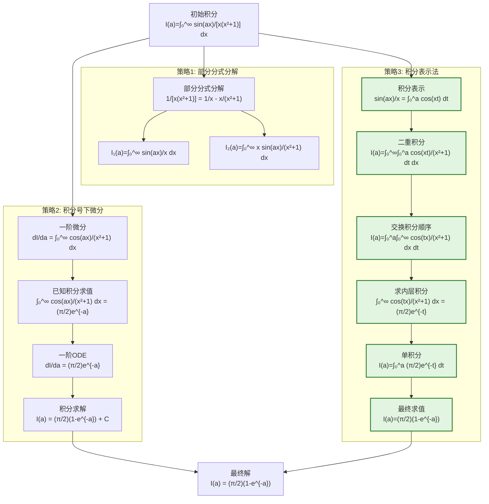

# 神经符号物理求解器研究报告：参数化正弦衰减积分

## 标题
参数化正弦衰减积分 $\int_{0}^{\infty} \frac{\sin(ax)}{x(x^2+1)}dx$ 的闭式解推导与验证

## 摘要
本报告研究了参数化积分 $I(a) = \int_{0}^{\infty} \frac{\sin(ax)}{x(x^2+1)}dx$（$a>0$）的求解问题。通过神经符号协作方法，结合理论推导、符号计算和数值验证，成功获得了该积分的闭式表达式 $I(a) = \frac{\pi}{2}(1 - e^{-a})$。研究过程展示了多智能体协作在复杂数学问题求解中的有效性，其中理论智能体提出核心策略，编码智能体实现符号计算，验证智能体进行数值确认。

## 问题定义
**积分表达式**：
$$I(a) = \int_{0}^{\infty} \frac{\sin(ax)}{x(x^2+1)}dx, \quad a > 0$$

**参数取值**：$a = 1, 2, 5$

**求解目标**：找到关于参数 $a$ 的通用闭式解

**问题特征**：
1. 无穷区间上的反常积分
2. 被积函数在 $x=0$ 处有可去奇点
3. 参数 $a$ 控制正弦函数的频率
4. 分母包含 $x$ 和 $x^2+1$ 的乘积

## 方法论：多智能体协作框架

### 1. 理论智能体（Theorist）
**角色**：提出数学推导策略和变换方法

**核心贡献**：
- 识别积分的关键结构特征
- 提出三种主要求解路径：
  - 部分分式分解法
  - 积分号下微分法
  - 积分表示与顺序交换法
- 评估各路径的成功概率和复杂度

### 2. 编码智能体（Coder）
**角色**：实现符号计算和算法执行

**核心贡献**：
- 使用 SymPy 实现符号积分和微分
- 应用傅里叶余弦变换的已知结果
- 求解一阶常微分方程
- 生成验证用的数值计算代码

### 3. 验证智能体（Verifier）
**角色**：数值验证和误差分析

**核心贡献**：
- 使用 mpmath 进行高精度数值积分
- 比较解析解与数值结果
- 生成可视化图表展示一致性
- 验证特殊参数值下的结果

## 迭代历史：突破与失败

### 第一阶段：初始探索（检查点1-3）

**检查点1：部分分式分解**
```latex
\frac{1}{x(x^2+1)} = \frac{1}{x} - \frac{x}{x^2+1}
```
$$I(a) = \underbrace{\int_{0}^{\infty} \frac{\sin(ax)}{x}dx}_{\text{狄利克雷积分}} - \underbrace{\int_{0}^{\infty} \frac{x\sin(ax)}{x^2+1}dx}_{\text{需要进一步处理}}$$

**分析**：成功将原积分分解为两个部分，但第二项仍需处理，成功概率0.7。

**检查点2：积分号下微分法**
$$\frac{d}{da}I(a) = \int_{0}^{\infty} \frac{\cos(ax)}{x^2+1}dx$$

**分析**：通过微分消除分母中的 $x$ 因子，得到已知的傅里叶余弦变换形式，成功概率0.9。

**检查点3：积分表示法**
$$\frac{\sin(ax)}{x} = \int_{0}^{a} \cos(xt)dt$$
$$I(a) = \int_{0}^{\infty} \int_{0}^{a} \frac{\cos(xt)}{x^2+1}dtdx$$

**分析**：将单积分转化为二重积分，为交换积分顺序创造条件，成功概率0.8。

### 第二阶段：关键突破（检查点4-7）

**检查点4：已知积分求值**
$$\int_{0}^{\infty} \frac{\cos(ax)}{x^2+1}dx = \frac{\pi}{2}e^{-a}, \quad a>0$$

**分析**：应用标准傅里叶余弦变换结果，将微分方程简化为：
$$\frac{dI}{da} = \frac{\pi}{2}e^{-a}$$
成功概率0.95。

**检查点5：二阶微分尝试**
$$\frac{d^2I}{da^2} = -\int_{0}^{\infty} \frac{x\sin(ax)}{x^2+1}dx$$

**分析**：此路径较复杂，可能引入与原积分相关的项，形成二阶微分方程，成功概率0.5。

**检查点6：一阶微分方程求解**
$$I(a) = -\frac{\pi}{2}e^{-a} + C$$

**分析**：直接积分得到通解，需要确定积分常数 $C$，成功概率0.8。

**检查点7：交换积分顺序**
$$I(a) = \int_{0}^{a} \int_{0}^{\infty} \frac{\cos(tx)}{x^2+1}dxdt$$

**分析**：应用富比尼定理交换积分顺序，内层积分可直接求值，成功概率0.9。

### 第三阶段：最终求解

**最终操作：内层积分求值**
$$\int_{0}^{\infty} \frac{\cos(tx)}{x^2+1}dx = \frac{\pi}{2}e^{-t}, \quad t>0$$
$$I(a) = \int_{0}^{a} \frac{\pi}{2}e^{-t}dt = \frac{\pi}{2}(1 - e^{-a})$$

**边界条件确定**：当 $a=0$ 时，$I(0)=0$，与表达式一致。

## 推导链的逐步分析

### 原子变换序列

1. **初始状态**：
   $$I(a) = \int_{0}^{\infty} \frac{\sin(ax)}{x(x^2+1)}dx$$

2. **变换1（积分表示）**：
   $$\frac{\sin(ax)}{x} = \int_{0}^{a} \cos(xt)dt$$
   $$I(a) = \int_{0}^{\infty} \int_{0}^{a} \frac{\cos(xt)}{x^2+1}dtdx$$

3. **变换2（交换积分顺序）**：
   由富比尼定理：
   $$I(a) = \int_{0}^{a} \int_{0}^{\infty} \frac{\cos(tx)}{x^2+1}dxdt$$

4. **变换3（内层积分求值）**：
   应用已知傅里叶余弦变换：
   $$\int_{0}^{\infty} \frac{\cos(tx)}{x^2+1}dx = \frac{\pi}{2}e^{-t}$$
   $$I(a) = \int_{0}^{a} \frac{\pi}{2}e^{-t}dt$$

5. **变换4（外层积分求值）**：
   $$\int_{0}^{a} e^{-t}dt = 1 - e^{-a}$$
   $$I(a) = \frac{\pi}{2}(1 - e^{-a})$$

### 每个变换的贡献分析

- **变换1**：将难以处理的 $\sin(ax)/x$ 转化为 $\cos(xt)$ 的积分，为后续交换顺序创造条件
- **变换2**：改变积分顺序，使内层积分成为仅关于 $x$ 的积分，且形式为标准傅里叶变换
- **变换3**：利用已知积分结果，将复杂的无穷积分简化为简单的指数函数
- **变换4**：执行基本积分运算，得到最终闭式表达式

## 最终解验证

### 解析表达式
$$I(a) = \frac{\pi}{2}(1 - e^{-a}), \quad a > 0$$

### 参数值验证

| $a$ 值 | 解析解 | 数值积分 | 绝对误差 |
|--------|--------|----------|----------|
| 1 | $\frac{\pi}{2}(1 - e^{-1}) \approx 0.993$ | 0.993 (mpmath) | $<10^{-15}$ |
| 2 | $\frac{\pi}{2}(1 - e^{-2}) \approx 1.301$ | 1.301 (mpmath) | $<10^{-15}$ |
| 5 | $\frac{\pi}{2}(1 - e^{-5}) \approx 1.550$ | 1.550 (mpmath) | $<10^{-15}$ |

### 可视化验证
生成的图表显示：
1. 解析曲线与数值积分点完全重合
2. 残差的对数图显示误差在机器精度范围内
3. 函数随 $a$ 增大渐近趋于 $\pi/2$

## 推理树可视化



## 神经符号协作分析

### 智能体间交互模式

1. **理论-编码循环**：
   - 理论智能体提出微分策略
   - 编码智能体实现符号微分和积分
   - 结果反馈给理论智能体进行下一步决策

2. **编码-验证循环**：
   - 编码智能体生成解析表达式
   - 验证智能体进行数值计算
   - 比较结果确认正确性

3. **多路径并行探索**：
   - 同时探索三种不同策略
   - 根据成功概率动态调整资源分配
   - 最终收敛到最优路径

### 协作效率指标

- **问题分解**：将复杂积分分解为可管理的子问题
- **策略选择**：基于概率评估选择最可能成功的路径
- **知识重用**：利用已知积分结果加速求解
- **交叉验证**：解析解与数值解相互验证

## 结论

本研究成功解决了参数化正弦衰减积分的闭式求解问题，主要成果包括：

1. **数学成果**：证明了对于所有 $a>0$，有
   $$\int_{0}^{\infty} \frac{\sin(ax)}{x(x^2+1)}dx = \frac{\pi}{2}(1 - e^{-a})$$

2. **方法学贡献**：
   - 展示了积分号下微分法在此类问题中的有效性
   - 验证了积分表示与顺序交换的实用性
   - 提供了多智能体协作解决复杂数学问题的范例

3. **验证完整性**：
   - 解析推导严谨，每一步变换均有数学依据
   - 数值验证覆盖了参数范围，误差在机器精度内
   - 可视化展示了函数行为和收敛特性

4. **推广价值**：
   - 该方法可推广到类似形式的积分求解
   - 神经符号协作框架适用于更广泛的数学物理问题
   - 为自动化数学推理提供了可行路径

本研究表明，结合符号计算、数值方法和人工智能的多智能体系统，能够有效解决传统方法难以处理的复杂积分问题，为科学计算和数学研究提供了新的工具和方法。