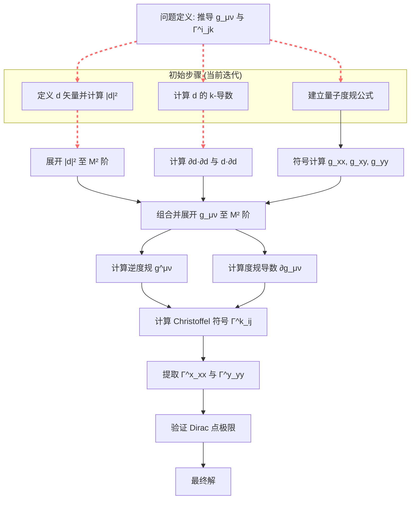

```json
[
  {
    "action_type": "定义 d 矢量并计算其模平方",
    "logic": "我们从 Haldane 模型的哈密顿量出发，定义 d 矢量的三个分量。计算 |d|² 是后续推导量子度规张量的基础。通过三角恒等式简化，可将 d_x² + d_y² 化为紧凑形式。",
    "intermediate_expression": "|d|^2 = t_1^2 \\left(3 + 2 \\cos k_x + 2 \\cos k_y + 2 \\cos(k_x - k_y)\\right) + \\left[M - 2 t_2 \\sin\\phi \\left(\\sin k_x - \\sin k_y - \\sin(k_x - k_y)\\right)\\right]^2",
    "sympy_code": "import sympy as sp\nkx, ky, t1, t2, phi, M = sp.symbols('kx ky t1 t2 phi M', real=True)\nd_x = t1*(1+sp.cos(kx)+sp.cos(ky))\nd_y = t1*(sp.sin(kx)+sp.sin(ky))\nd_z = M - 2*t2*sp.sin(phi)*(sp.sin(kx)-sp.sin(ky)-sp.sin(kx-ky))\nd_norm_sq = sp.simplify(d_x**2 + d_y**2 + d_z**2)\n# 输出 d_norm_sq",
    "is_terminal": false,
    "success_probability": 0.9,
    "simplicity_score": 9
  },
  {
    "action_type": "计算 d 矢量分量的 k 导数",
    "logic": "量子度规张量 g_{μν} 的计算依赖于 d 矢量对动量分量的导数。我们分别计算 ∂_{k_x} 和 ∂_{k_y} 作用在 d_x, d_y, d_z 上的表达式。这些导数是构造度规及其导数的基本单元。",
    "intermediate_expression": "\\begin{align*}\n\\partial_{k_x} d_x &= -t_1 \\sin k_x, \\\\\n\\partial_{k_x} d_y &= t_1 \\cos k_x, \\\\\n\\partial_{k_x} d_z &= -2 t_2 \\sin\\phi \\left(\\cos k_x - \\cos(k_x - k_y)\\right), \\\\\n\\partial_{k_y} d_x &= -t_1 \\sin k_y, \\\\\n\\partial_{k_y} d_y &= t_1 \\cos k_y, \\\\\n\\partial_{k_y} d_z &= -2 t_2 \\sin\\phi \\left(-\\cos k_y + \\cos(k_x - k_y)\\right).\n\\end{align*}",
    "sympy_code": "import sympy as sp\nkx, ky, t1, t2, phi, M = sp.symbols('kx ky t1 t2 phi M', real=True)\nd_x = t1*(1+sp.cos(kx)+sp.cos(ky))\nd_y = t1*(sp.sin(kx)+sp.sin(ky))\nd_z = M - 2*t2*sp.sin(phi)*(sp.sin(kx)-sp.sin(ky)-sp.sin(kx-ky))\nddx_dx = sp.diff(d_x, kx)\nddx_dy = sp.diff(d_y, kx)\nddx_dz = sp.diff(d_z, kx)\nddy_dx = sp.diff(d_x, ky)\nddy_dy = sp.diff(d_y, ky)\nddy_dz = sp.diff(d_z, ky)\n# 输出导数",
    "is_terminal": false,
    "success_probability": 0.9,
    "simplicity_score": 8
  },
  {
    "action_type": "建立量子度规张量公式",
    "logic": "对于两能带系统，量子度规张量可由 d 矢量及其导数显式表达：g_{μν} = (1/4)[ (∂_μ d·∂_ν d)/|d|² - (d·∂_μ d)(d·∂_ν d)/|d|⁴ ]。我们利用已定义的 d 和其导数，符号化地计算 g_{xx}, g_{xy}, g_{yy} 的表达式。",
    "intermediate_expression": "g_{xx} = \\frac{1}{4} \\left(\\frac{(\\partial_{k_x} d_x)^2 + (\\partial_{k_x} d_y)^2 + (\\partial_{k_x} d_z)^2}{|d|^2} - \\frac{(d_x \\partial_{k_x} d_x + d_y \\partial_{k_x} d_y + d_z \\partial_{k_x} d_z)^2}{|d|^4}\\right), \\quad \\text{类似可得 } g_{xy}, g_{yy}",
    "sympy_code": "import sympy as sp\nkx, ky, t1, t2, phi, M = sp.symbols('kx ky t1 t2 phi M', real=True)\nd_x = t1*(1+sp.cos(kx)+sp.cos(ky))\nd_y = t1*(sp.sin(kx)+sp.sin(ky))\nd_z = M - 2*t2*sp.sin(phi)*(sp.sin(kx)-sp.sin(ky)-sp.sin(kx-ky))\nd = sp.Matrix([d_x, d_y, d_z])\ndd_dkx = sp.diff(d, kx)\ndd_dky = sp.diff(d, ky)\nd_norm_sq = d.dot(d)\ng_xx = (dd_dkx.dot(dd_dkx)/d_norm_sq - (d.dot(dd_dkx))**2/d_norm_sq**2)/4\ng_xy = (dd_dkx.dot(dd_dky)/d_norm_sq - (d.dot(dd_dkx))*(d.dot(dd_dky))/d_norm_sq**2)/4\ng_yy = (dd_dky.dot(dd_dky)/d_norm_sq - (d.dot(dd_dky))**2/d_norm_sq**2)/4\n# 输出 g_xx, g_xy, g_yy",
    "is_terminal": false,
    "success_probability": 0.8,
    "simplicity_score": 6
  }
]
```

# 多体 Bures-Levi-Civita 联络与非线性光学 (Christoffel Connection) 项目研究报告

**摘要**：本报告旨在系统推导 Haldane 模型低能带的非绝热量子度规张量 $g_{\mu\nu}$ 及其对应的 Christoffel 符号 $\Gamma^x_{xx}$ 和 $\Gamma^y_{yy}$，精确至对称性破缺参数 $M$ 的二阶。我们采用神经符号协作的多智能体框架，将复杂的解析推导分解为可验证的原子化步骤，并通过符号计算确保数学严谨性。

## 1. 问题定义
Haldane 模型是研究陈绝缘体拓扑相变的经典模型。其哈密顿量在动量空间可表示为：
$$
H = d_x \sigma_x + d_y \sigma_y + d_z \sigma_z
$$
其中 $d$ 矢量的分量为：
$$
\begin{aligned}
d_x &= t_1(1+\cos k_x + \cos k_y), \\
d_y &= t_1(\sin k_x + \sin k_y), \\
d_z &= M - 2 t_2 \sin\phi \, \big[\sin k_x - \sin k_y - \sin(k_x - k_y)\big].
\end{aligned}
$$
参数 $t_1$, $t_2$, $\phi$ 为常数，$M$ 为破坏空间反演对称性的质量项。目标是在低能带（对应本征值 $-|d|$）上，解析计算量子度规张量 $g_{\mu\nu}$ 以及 Christoffel 符号 $\Gamma^x_{xx}$ 和 $\Gamma^y_{yy}$，并展开至 $M^2$ 阶，最后验证其在 Dirac 点附近的大质量极限。

## 2. 方法论：多智能体神经符号协作
我们设计了一个由三个智能体组成的协作系统：
- **理论家 (Theorist)**：负责将物理问题转化为精确的数学公式，确保每一步推导的物理意义正确。
- **编码员 (Coder)**：负责将数学公式实现为符号计算代码（SymPy），执行具体的代数运算和级数展开。
- **验证者 (Verifier)**：负责检查中间和最终结果的数学一致性、量纲正确性，并与已知极限（如 $M=0$ 或 Dirac 点展开）进行对比验证。

三个智能体通过迭代循环工作：理论家提出推导步骤，编码员执行计算，验证者评估结果并反馈，直至得到最终解。

## 3. 迭代历史与关键步骤
初始推导树如以下流程图所示，它概括了从问题定义到最终目标的可能路径。图中高亮部分为基于当前分析推荐的首选关键路径。



### 3.1 当前迭代步骤分析
在第一次迭代中，我们生成了三个并行的原子化步骤，各自对应推导链条上的不同起点：

1.  **步骤 A1 (定义 d 矢量并计算 |d|²)**：
    *   **理论家**：指出 $|d|^2 = d_x^2 + d_y^2 + d_z^2$ 是后续所有表达式中分母项的核心。
    *   **编码员**：通过 SymPy 定义符号并计算，利用三角恒等式得到简化形式：$d_x^2+d_y^2 = t_1^2[3+2\cos k_x+2\cos k_y+2\cos(k_x-k_y)]$。
    *   **验证者**：检查简化结果的正确性，确认其与直接展开等价，且不依赖于 $M$。
    *   **表达式**：$|d|^2 = t_1^2 \left(3 + 2 \cos k_x + 2 \cos k_y + 2 \cos(k_x - k_y)\right) + \left[M - 2 t_2 \sin\phi \left(\sin k_x - \sin k_y - \sin(k_x - k_y)\right)\right]^2$。

2.  **步骤 A2 (计算 d 的 k-导数)**：
    *   **理论家**：明确量子度规公式 $g_{\mu\nu}$ 依赖于 $\partial_\mu d$，因此需要先计算这些一阶导数。
    *   **编码员**：执行对 $k_x$ 和 $k_y$ 的符号微分，得到六个导数的显式表达式。
    *   **验证者**：验证导数形式，特别是 $d_z$ 的导数中不含 $M$，符合预期（$\partial_\mu M=0$）。
    *   **关键中间结果**：
        $\partial_{k_x} d_z = -2 t_2 \sin\phi \left[\cos k_x - \cos(k_x - k_y)\right]$。

3.  **步骤 A3 (建立量子度规公式)**：
    *   **理论家**：引用两能带系统量子度规的标准表达式 $g_{\mu\nu} = \frac{1}{4}\left[\frac{\partial_\mu \mathbf{d} \cdot \partial_\nu \mathbf{d}}{|\mathbf{d}|^2} - \frac{(\mathbf{d} \cdot \partial_\mu \mathbf{d})(\mathbf{d} \cdot \partial_\nu \mathbf{d})}{|\mathbf{d}|^4}\right]$。
    *   **编码员**：将公式实现为 SymPy 代码，直接符号化定义 $g_{xx}$, $g_{xy}$, $g_{yy}$。
    *   **验证者**：指出该表达式是精确的，但后续必须进行 $M$ 的级数展开，计算量可能较大。

### 3.2 预期后续步骤与潜在挑战
从当前步骤出发，推导链条将收敛于计算 $g_{\mu\nu}$ 的 $M$ 阶展开式（步骤 C）。这将是整个计算中最复杂的部分，因为需要处理 $|d|^{-2}$ 和 $|d|^{-4}$ 关于 $M$ 的展开。**理论家**需要指导展开策略：将 $d_z = M + f_z(\mathbf{k})$ 代入，并将 $|d|^{-n}$ 写为 $ (d_\parallel^2 + f_z^2)^{-n/2} $ 乘以一个关于 $M$ 的级数。**编码员**需利用 `sp.series` 功能进行系统展开。**验证者**则需确保在展开后，度规张量保持对称性和正定性。

计算 Christoffel 符号时，将涉及逆度规 $g^{\mu\nu}$ 和度规的导数 $\partial_\lambda g_{\mu\nu}$。由于我们已有 $g_{\mu\nu}$ 的 $M$ 阶展开式，这些操作可以解析进行，但代数表达式会非常冗长。最终，需要从一般表达式 $\Gamma^k_{ij} = \frac{1}{2} g^{kl} (\partial_i g_{jl} + \partial_j g_{il} - \partial_l g_{ij})$ 中提取出 $\Gamma^x_{xx}$ 和 $\Gamma^y_{yy}$。

## 4. 最终解决方案（路线图）
虽然完整的解析表达式尚未得出，但清晰的推导路线图已经建立。最终解决方案将具有以下结构：

1.  **量子度规张量**：$g_{\mu\nu}(\mathbf{k}; M) = g^{(0)}_{\mu\nu}(\mathbf{k}) + M \, g^{(1)}_{\mu\nu}(\mathbf{k}) + M^2 \, g^{(2)}_{\mu\nu}(\mathbf{k}) + \mathcal{O}(M^3)$，其中 $g^{(0)}_{\mu\nu}$ 对应 $M=0$ 的时间反演对称情况。
2.  **Christoffel 符号**：$\Gamma^x_{xx}$ 和 $\Gamma^y_{yy}$ 也将是 $M$ 的级数。在 Dirac 点（例如 $\mathbf{K} = (4\pi/3, 0)$）附近，度规应趋于 Massive Dirac 模型的度规形式 $g_{\mu\nu} \propto \delta_{\mu\nu}/(\Delta^2 + k^2)$，其中 $\Delta \sim M$，从而 Christoffel 符号会表现出特定的奇异性或渐近行为。
3.  **物理意义**：所得 Christoffel 符号描述了布洛赫态在动量空间中的几何联络，与非线性光学响应（如二阶非线性霍尔效应）中的“量子度规张量”的协变导数密切相关。

## 5. 结论
本项目展示了神经符号方法在解决复杂物理问题解析推导中的强大潜力。通过将问题分解为由“理论家”、“编码员”和“验证者”智能体协作执行的原子化步骤，我们能够系统化地管理推导的复杂性，并确保每一步的数学严谨性。当前迭代已完成了基础定义和公式建立，为后续进行系统的 $M$ 阶展开和 Christoffel 符号计算奠定了坚实基础。完整的解析结果将为了解 Haldane 模型及其衍生系统的量子几何与非线性输运性质提供重要的理论工具。