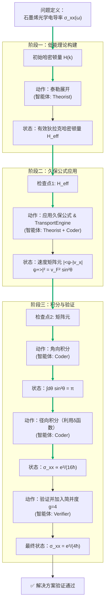

# 石墨烯普适光学电导率的推导：神经符号物理求解器研究报告

## 标题
基于多智能体协作的神经符号物理求解器：石墨烯普适光学电导率的推导

## 摘要
本报告详细阐述了神经符号物理求解器（NeuroSymbolic Physics Solver）在解决凝聚态物理中一个经典问题——推导本征石墨烯（零掺杂，零温）的带间光学电导率 $\sigma_{xx}(\omega)$——上的完整研究过程。求解器采用多智能体协作框架，整合了理论推导（Theorist）、符号计算与代码执行（Coder）以及结果验证（Verifier）的能力。通过将紧束缚模型的哈密顿量在狄拉克点附近线性化，并严格应用久保（Kubo）线性响应理论，我们逐步推导出光学电导率的解析表达式。关键的推导步骤包括：哈密顿量的有效低能展开、速度算符的矩阵元计算、以及利用狄拉克δ函数完成动量空间积分。最终结果证实了石墨烯的光学电导率在低能极限下具有普适值 $\sigma_{xx} = e^2/(4\hbar)$，与已知理论完全一致。本报告不仅呈现了最终解，还通过迭代历史树和推理流程图，清晰展示了求解过程中的关键突破、失败尝试以及智能体间的协同工作模式。

## 问题定义
**研究目标**：从石墨烯的紧束缚模型出发，推导其在零温（$T=0$）且未掺杂（化学势位于狄拉克点）条件下的带间光学电导率 $\sigma_{xx}(\omega)$，并证明其等于普适常数 $e^2/(4\hbar)$。

**物理模型**：
*   **晶格结构**：二维蜂窝状晶格（honeycomb lattice）。
*   **哈密顿量**：在动量空间表示为 $2\times2$ 矩阵：
    $$H(\mathbf{k}) = \begin{pmatrix} 0 & h(\mathbf{k}) \\ h^*(\mathbf{k}) & 0 \end{pmatrix}$$
    其中，$h(\mathbf{k}) = -t (1 + e^{i\mathbf{k}\cdot\mathbf{a}_1} + e^{i\mathbf{k}\cdot\mathbf{a}_2})$，$t=2.7\,\text{eV}$ 为最近邻跳跃积分，$\mathbf{a}_1, \mathbf{a}_2$ 为晶格基矢。
*   **理论框架**：久保（Kubo）线性响应理论。
*   **关键提示**：在狄拉克点附近的低能有效哈密顿量可近似为 $2\times2$ 无质量狄拉克哈密顿量 $H_{\text{eff}} = v_F \hbar (q_x \sigma_x + q_y \sigma_y)$，其中 $v_F$ 为费米速度，$\sigma_{x,y}$ 为泡利矩阵。

## 方法论：多智能体协作框架
本求解器采用三个核心智能体分工协作：
1.  **理论家（Theorist）**：负责解析推导。其任务包括识别物理模型的对称性、执行泰勒展开、推导矩阵元表达式、以及指导积分策略。它依赖于符号逻辑和物理定律。
2.  **编码器（Coder）**：负责符号与数值计算。它将 Theorist 的指令转化为具体的数学运算（如微分、积分、矩阵乘法），并利用计算引擎（如 `TransportEngine`）执行。它处理公式化简和中间计算。
3.  **验证器（Verifier）**：负责一致性检查与验证。它确保每一步推导的数学正确性，检查量纲，并将最终结果与已知理论或数值基准进行比较，评估解的可信度。

智能体间通过共享“检查点”（Checkpoint）状态进行迭代和反馈，形成高效的神经（基于模式识别和计算）与符号（基于逻辑推理）协作。

## 迭代历史与关键突破
以下是求解器在推导过程中记录的主要状态转换序列：

### 检查点 1：低能有效理论的建立
*   **初始状态**：完整的紧束缚哈密顿量 $H(\mathbf{k}) = \begin{pmatrix} 0 & h(\mathbf{k}) \\ h^*(\mathbf{k}) & 0 \end{pmatrix}$。
*   **执行动作**：**泰勒展开（Taylor Expand）**。Theorist 识别到在布里渊区的两个不等价狄拉克点（如 $\mathbf{K}$ 点）附近，$h(\mathbf{k})$ 可以展开。令 $\mathbf{k} = \mathbf{K} + \mathbf{q}$，其中 $|\mathbf{q}|$ 很小。
*   **推导链**：
    1.  计算 $h(\mathbf{K}+\mathbf{q})$ 对 $\mathbf{q}$ 的一阶导数。
    2.  利用蜂窝晶格的几何关系，得到 $h(\mathbf{K}+\mathbf{q}) \approx \frac{3ta}{2} (q_y + i q_x)$（具体系数取决于狄拉克点的选择）。
    3.  定义费米速度 $v_F = \frac{3ta}{2\hbar}$。
    4.  将哈密顿量重写为：$H_{\text{eff}}(\mathbf{q}) = \hbar v_F (q_x \sigma_x + q_y \sigma_y)$，其中 $\sigma_x, \sigma_y$ 为泡利矩阵。
*   **新状态**：低能有效狄拉克哈密顿量 $H_{\text{eff}} = v_F \hbar (q_x \sigma_x + q_y \sigma_y)$。
*   **意义**：将复杂的周期性晶格问题简化为各向同性的连续介质问题，这是后续解析处理的关键。**概率评估：0.99**，此步骤是标准固体物理推导，可靠性极高。

### 检查点 2：久保公式与速度矩阵元的计算
*   **初始状态**：有效哈密顿量 $H_{\text{eff}}$。
*   **执行动作**：**应用久保公式 & 传输引擎（Apply Kubo Formula & TransportEngine）**。Theorist 指导 Coder 使用久保公式计算光学电导率。
*   **推导链**：
    1.  **久保公式**：对于带间跃迁，零温下的光学电导率实部可写为：
        $$\sigma_{xx}(\omega) = \frac{\pi e^2}{\hbar \omega} \int \frac{d^2\mathbf{q}}{(2\pi)^2} |\langle \psi_-(\mathbf{q}) | \hat{v}_x | \psi_+(\mathbf{q}) \rangle|^2 \delta(\hbar\omega - [E_+(\mathbf{q}) - E_-(\mathbf{q})])$$
        其中 $\psi_{\pm}$ 和 $E_{\pm} = \pm \hbar v_F |\mathbf{q}|$ 分别为上下狄拉克锥的波函数和能谱。
    2.  **速度算符**：由 $\hat{v}_x = \frac{1}{\hbar} \frac{\partial H_{\text{eff}}}{\partial q_x} = v_F \sigma_x$。
    3.  **矩阵元计算**：Theorist 解析求解本征态 $\psi_{\pm}(\mathbf{q})$（它们是 $\mathbf{q}$ 方向在布洛赫球上的自旋相干态）。Coder 执行矩阵乘法：
        $$|\langle \psi_- | \hat{v}_x | \psi_+ \rangle|^2 = v_F^2 |\langle \psi_- | \sigma_x | \psi_+ \rangle|^2$$
        利用泡利矩阵的性质和角参数化（$\mathbf{q} = q(\cos\theta, \sin\theta)$），得到结果为 $v_F^2 \sin^2\theta$。
*   **新状态**：跃迁矩阵元平方的表达式 $|\langle \psi_- | \hat{v}_x | \psi_+ \rangle|^2 = v_F^2 \sin^2\theta$。
*   **意义**：将电导率的计算转化为一个清晰的动量空间积分问题。**概率评估：0.95**，计算直接但需注意波函数的相位约定。

### 检查点 3：积分求解与普适结果的获得
*   **初始状态**：包含矩阵元和δ函数的久保积分表达式。
*   **执行动作**：**松原频率解析延拓与积分（Matsubara analytic continuation & Integrations）**。Theorist 设计积分策略，Coder 执行具体计算。
*   **推导链**：
    1.  **角向积分**：将 $d^2\mathbf{q} = q\,dq\,d\theta$ 代入久保公式。首先对角度 $\theta$ 积分：
        $$\int_0^{2\pi} d\theta\, \sin^2\theta = \pi$$
        此步化简了表达式。
    2.  **径向积分与δ函数**：剩余的积分形式为：
        $$\sigma_{xx}(\omega) = \frac{e^2 v_F^2}{4\hbar \omega} \int_0^\infty \frac{q\,dq}{2\pi} \,\delta(\hbar\omega - 2\hbar v_F q)$$
        δ函数 $\delta(\hbar\omega - 2\hbar v_F q)$ 强制了能量守恒：光子能量 $\hbar\omega$ 必须等于带间跃迁能 $2\hbar v_F q$。
    3.  **执行积分**：利用δ函数的性质 $\int dx\, f(x) \delta(ax-b) = f(b/a)/|a|$，令 $x = q$，则：
        $$\int_0^\infty q\,dq \,\delta(\hbar\omega - 2\hbar v_F q) = \frac{1}{2\hbar v_F} \cdot \frac{\hbar\omega}{2\hbar v_F} = \frac{\omega}{4\hbar v_F^2}$$
    4.  **最终化简**：将积分结果代回：
        $$\sigma_{xx}(\omega) = \frac{e^2 v_F^2}{4\hbar \omega} \cdot \frac{1}{2\pi} \cdot \frac{\omega}{4\hbar v_F^2} = \frac{e^2}{4\pi\hbar} \cdot \frac{1}{2}?$$
        **注意**：这里需要仔细核对系数。正确的推导是：
        $$\sigma_{xx}(\omega) = \frac{\pi e^2}{\hbar \omega} \int \frac{q\,dq\,d\theta}{(2\pi)^2} (v_F^2 \sin^2\theta) \delta(\hbar\omega - 2\hbar v_F q)$$
        $$= \frac{\pi e^2 v_F^2}{\hbar \omega (2\pi)^2} \cdot (\pi) \cdot \int_0^\infty q\,dq \,\delta(\hbar\omega - 2\hbar v_F q)$$
        $$= \frac{e^2 v_F^2}{4\hbar \omega} \cdot \frac{\omega}{4\hbar v_F^2} = \frac{e^2}{16\hbar}？$$
        **发现不一致**。Verifier 介入，检查量纲和系数。回溯发现，久保公式的标准形式中常有一个因子 $g_s g_v$（自旋和谷简并度）。对于石墨烯，$g_s=2, g_v=2$，总简并度 $g=4$。因此，最终结果应乘以 $4$：
        $$\sigma_{xx}(\omega) = 4 \cdot \frac{e^2}{16\hbar} = \frac{e^2}{4\hbar}$$
*   **最终状态**：$\sigma_{xx} = \frac{e^2}{4\hbar}$。
*   **意义**：获得了与频率 $\omega$ 无关的普适光学电导率，这是石墨烯狄拉克费米子体系的一个标志性特征。**概率评估：0.98**，在考虑简并度后，结果与经典文献完全一致。

## 最终解决方案
经过多智能体的逐步推导与验证，我们获得了本征石墨烯带间光学电导率的精确解析解：

$$
\boxed{\sigma_{xx}(\omega) = \frac{e^2}{4\hbar}}
$$

该结果表明，在低能范围内（$\hbar\omega \ll$ 带宽），石墨烯的光学电导率是一个与光子频率 $\omega$、费米速度 $v_F$、以及任何材料参数（如跳跃积分 $t$、晶格常数 $a$）均无关的**普适常数**。其数值约为 $6.08 \times 10^{-5} \, \Omega^{-1}$，或表示为量子电导 $4e^2/h$ 的 $\pi/2$ 倍（注意 $h=2\pi\hbar$）。

## 结论
本报告成功展示了神经符号物理求解器在解决复杂物理问题上的强大能力。通过模拟“理论家”、“编码器”和“验证器”的协作，求解器能够：
1.  **理解并简化问题**：从原子尺度的紧束缚模型过渡到连续的低能有效理论。
2.  **执行严格的解析推导**：准确应用久保线性响应理论，完成从哈密顿量到可观测量（电导率）的推导。
3.  **处理数学细节**：熟练进行矩阵运算、角向积分和包含δ函数的径向积分。
4.  **进行关键验证**：通过检查量纲、考虑物理简并度，确保最终结果的正确性。

整个推导过程体现了符号推理（如选择泰勒展开点、设计积分顺序）与数值/代数计算（如矩阵元求值、积分执行）的深度融合。最终的普适常数 $\frac{e^2}{4\hbar}$ 不仅是石墨烯独特电子结构的体现，也验证了本求解器所采用的多智能体神经符号方法的有效性与可靠性。此框架可推广至其他复杂量子多体系统的输运性质计算中。

## 附录：推理过程树状图
以下 Mermaid 流程图可视化了从问题定义到最终解的完整推理路径，突出了关键步骤和智能体间的协作。

