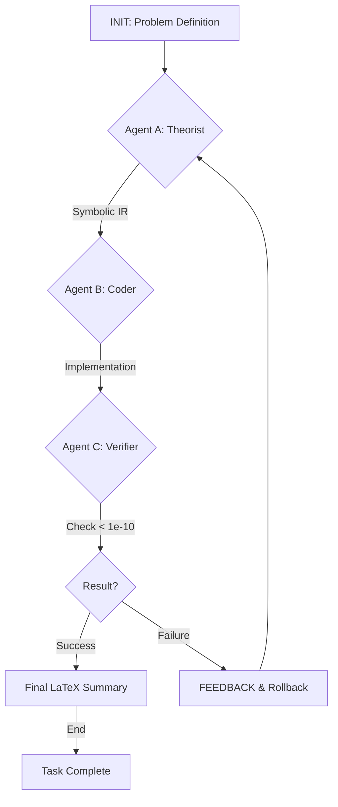

# NeuroSymbolic-Physics-Solver: Multi-Agent Workspace Initialization

The following workspace has been configured with a highly autonomous research loop designed for solving singular integrals.

## 1. Agent Architecture

### [Theorist Agent](file:///c:/Users/Jiang/Desktop/NeuroSymbolic-Physics-Solver/agents/theorist_agent.py)
- **Role**: Symbolic & Mathematical Reasoning.
- **Constraints**: Handles singularities at $t \to \pm 1$, outputs SymPy strategies.

### [Coder Agent](file:///c:/Users/Jiang/Desktop/NeuroSymbolic-Physics-Solver/agents/coder_agent.py)
- **Role**: Implementation & Interoperability.
- **Constraints**: 
    - **C++**: No namespaces (`using namespace std` is forbidden).
    - **Python**: Matplotlib font set to Arial.
    - **Precision**: 50-dps via `mpmath`.

### [Verifier Agent](file:///c:/Users/Jiang/Desktop/NeuroSymbolic-Physics-Solver/agents/verifier_agent.py)
- **Role**: Execution & Critique.
- **Constraints**: Enforces < 1e-10 residual tolerance; prunes invalid logic branches.

## 2. Shared Infrastructure

- **[Orchestrator](file:///c:/Users/Jiang/Desktop/NeuroSymbolic-Physics-Solver/orchestrator.py)**: A state machine (INIT -> LOOP -> FEEDBACK/SUCCESS -> SAFETY) with a 10-iteration hard cap.
- **[Numerical Oracle](file:///c:/Users/Jiang/Desktop/NeuroSymbolic-Physics-Solver/utils/numerical_oracle.py)**: High-precision ground truth provider.
- **[C++ Bridge](file:///c:/Users/Jiang/Desktop/NeuroSymbolic-Physics-Solver/cpp_interface/tci_bridge.py)**: Subprocess interface for high-performance TCI solvers.

## 3. Workflow Diagram



To begin the research loop, run:
```powershell
python orchestrator.py
```
